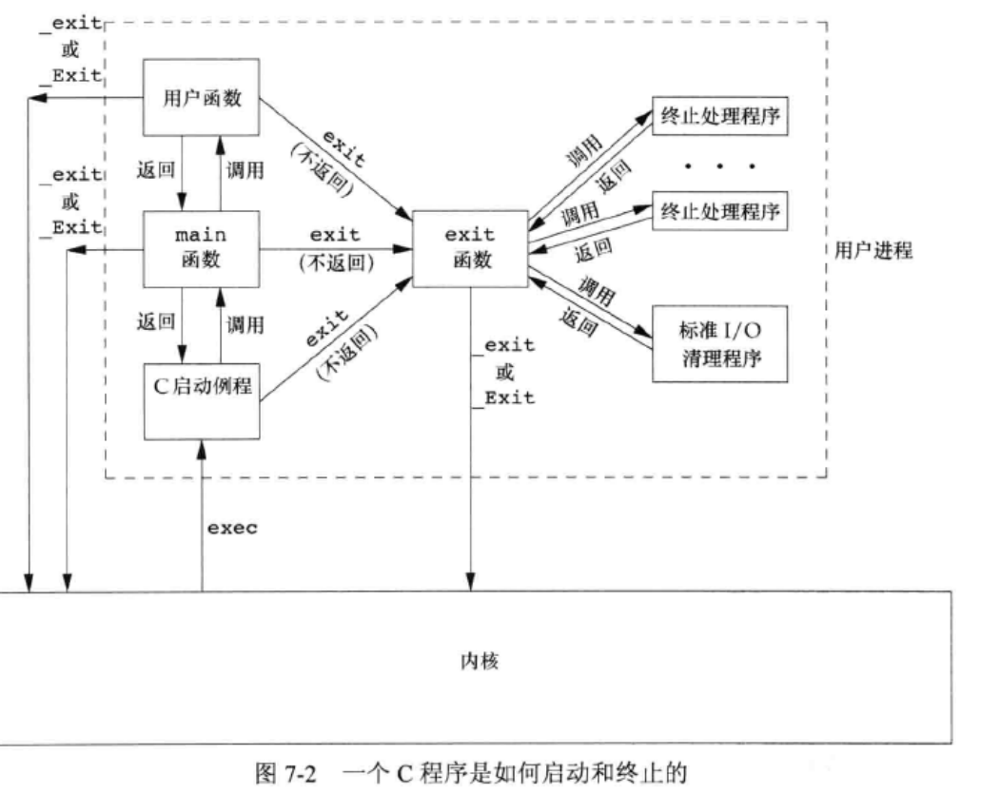
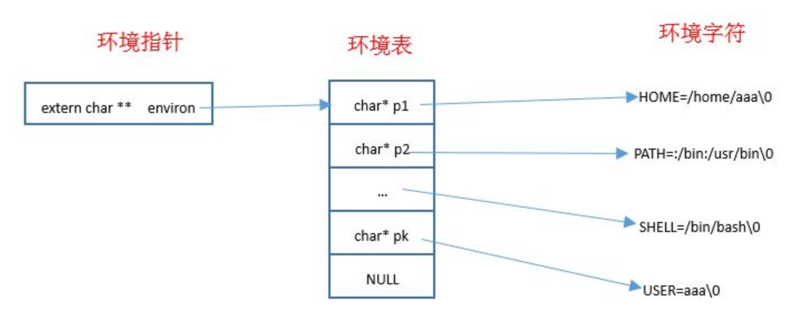
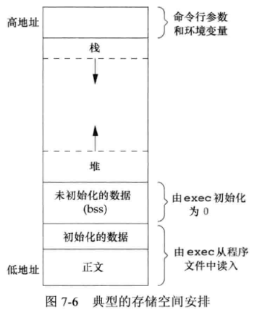
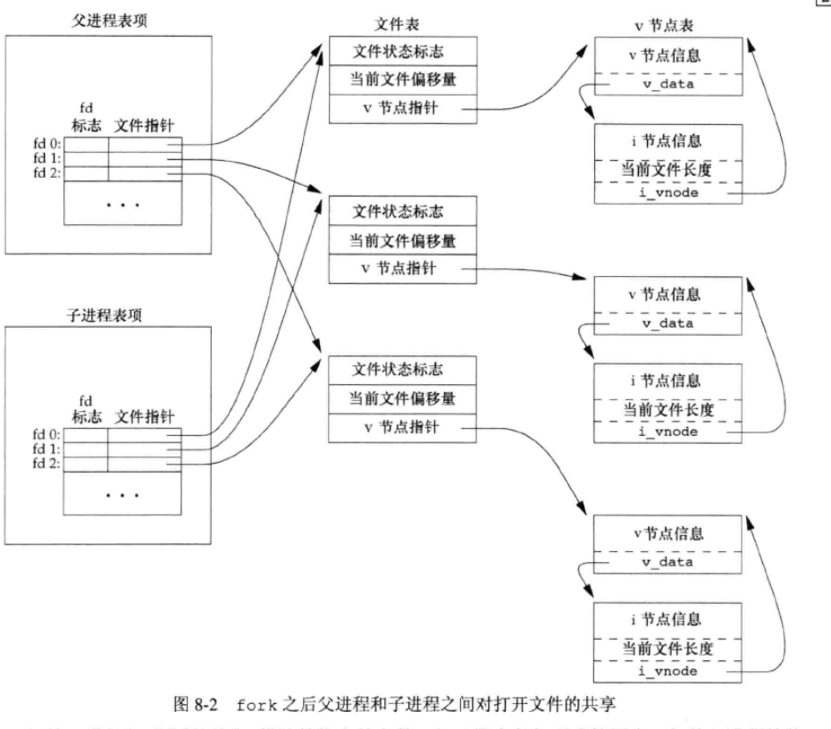
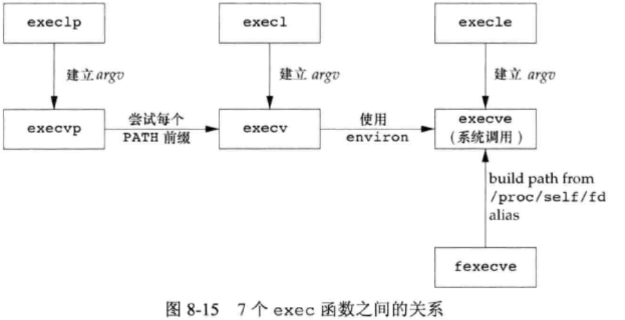
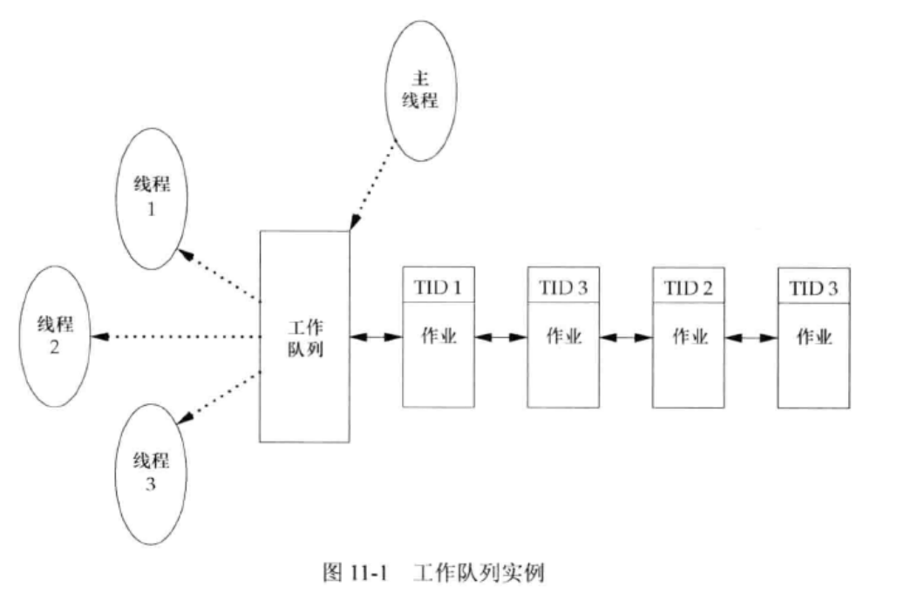

# UNIX编程·进程与线程

第7、8章，11章，15章

## 第七章 进程的环境

### C语言程序/进程的一生

#### 进程的出生

当程序执行被拉起一个进程时，最先启动的main 函数是如何被调用的？

```c
int main(int argc， char *argv[]);
//argc是命令行参数的数目，argv 是指向参数的各个指针所构成的数组。
//注意，`ISOC`和`POSIX`都要求`argv[argc]`是一个空指针
```

当内核执行C程序时，在调用main 前先调用一个特殊的**启动例程（主要是个exit函数）**,可执行程序文件将此启动例程指定为程序的起始地址（这是由连接编辑器设置的，而连接编辑器则由 C 编译器调用），启动例程从内核取得命令行参数和环境变量值，然后为按上述方式调用main函数做好安排。

补充，这个例程是这样写的（其实它是用汇编写的，毕竟在main执行之前）：从main函数返回后立即调用exit函数，形式为**`exec(main(argc,argv))`。**这个在后面一章讲的更清楚些。

#### 进程的终止

之后是关于进程的终止，有 8 种方式使得进程终止，其中 5 种为正常终止，3 种异常终止：

- 正常终止方式：
  - 从`main`函数返回
  - 调用`exit`函数
  - 调用`_exit`函数或者`_Exit`函数
  - 多线程的程序中，最后一个线程从其启动例程返回
  - 多线程的程序中，从最后一个线程调用`pthread_exit`函数
- 异常终止方式：
  - 调用`abort`函数
  - 接收到一个信号
  - 多线程的程序中，最后一个线程对取消请求作出响应

`exit/_Exit/_exit`函数三者用于自然正常终止一个程序，如下

```c
// stdlib.h库里
void exit(int status);
void _Exit(int status);
// unistd.h库里
void _exit(int status);
// 它们是不同的标准实现的，所以头文件不一样
```

其中的status整型参数指的是终止状态，`_exit`和`_Exit`函数是立刻进入内核，`exit`函数还要执行一些清理处理，再返回内核。这些终止状态如下：

- 若调用上述三个函数时不带终止状态，则该进程的终止状态是未定义的
- 若`main`执行了一个无返回值的`return`语句，则该进程的终止状态是未定义的
- 若`main`没有声明返回类型为整型，则该进程的终止状态是未定义的
- 若`main`声明返回类型为整型，并且`main`执行到最后一条语句时返回（隐式返回），则该进程的终止状态是 0。
- **`main`函数返回一个整型值与用该值调用`exit`是等价的。即`main`函数中，`exit(100);`等价于`return 100;`**
- 在LINUX中，退出状态码最高是255，一般自定义的代码值为0~255，如果超出255，**则返回该数值除以256的余数**。

之后说一下`exit`函数的清理函数`atexit`，为`int atexit(void (*func) (void));`

`*func`是个函数指针，执行一个函数的返回值`void`，成功返回0，失败返回非0。

一个进程可以登记最多 32 个函数，这些函数将由`exit`函数自动调用，这些函数称作终止处理程序（`atexit`函数就是登记它的）。需要注意的是，`exit`调用这些终止处理程序的顺序与登记它们的时候顺序相反，以及一个此类函数被登记多次，它也会被调用多次。

#### C程序的启动与终止小总结

- `exit`函数首先调用各终止处理程序。

- 内核执行程序的唯一方法是调用一个`exec`函数。

- 内核自愿终止的唯一方法是显式或者隐式（通过调用`exit`函数）的调用`_exit`或者`_Exit`，另外还有强制或者异常中止的方法，可以通过返回值来判断中止的类型。

  

### 环境表与环境变量



每个程序都会接收一张环境表，与参数数组一样，这也是一个字符指针数组，其中的每个指针指向一个**以null结束**的 C 字符串，这些字符串称之为环境字符串。

全局变量`envrion`包含了该指针数组的地址：`extern char **envrion`。我们称`environ`为环境指针，它位于头文件`unistd.h`中。

**环境字符串**由`name=value`这种格式的字符串组成。UNIX内核并不查看这些字符串，这些字符串的具体意义由各应用程序解释。

属于是环境变量的体现了↑下面就说环境变量

获取环境变量的值可以用`getenv`函数，`char *getenv(const char*name);`

`name`是环境变量的名字，调用成功返回与`name`关联的环境字符串`value`的指针，失败返回null。

设置环境变量的值可以用这几个函数

```
// include <stdlib.h>
int putenv(char *str);
// 直接设置形式为name=value的字符串，将其放置到进程的环境表中。如果`name`已经存在，则覆盖（非常底层的操作），成功返回0，失败返回非0。

int setenv(const char *name,const char *value,int rewrite);
// 参数依次为环境变量名、环境变量值、指定覆写行为（若为0则如果name在环境表中已存在，则直接返回而不修改；若不为0，直接将其覆写），成功返回0，失败返回-1。

int unsetenv(const char *name);
// 参数为环境变量名，unsetenv是从环境表中删除name的定义，成功返回0，失败返回-1。
```

它们的操作过程如下：

如果修改一个现有的`name`：

- 如果新的`value`长度少于或等于现有`value`的长度，则只需要将新字符串复制到原字符串所用的空间即可
- 如果新的`value`长度大于现有`value`的长度，则必须调用`malloc`为新字符串分配空间，然后将新字符串复制到该空间，接着使环境表中对`name`的指针指向新分配区并释放旧分配区。

如果增加一个新的`name`：

- 如果这是第一次增加一个新的`name`：
- - 则必须调用`malloc`为新指针表分配空间
  - 然后将原来的环境表复制到新分配区
  - 并将新的`name=value`字符串的指针存放到该指针表的表尾，
  - 然后将一个空指针存放在其后
  - 然后使`environ`指向新指针表
  - 最后释放旧的指针表
- 如果这不是第一次增加一个新的`name`，则可知以前已经调用了`malloc`：
- - 则只需要调用`realloc`，以分配比原空间多存放一个指针的空间
  - 并将新的`name=value`字符串的指针存放到该指针表的表尾，
  - 然后将一个空指针存放在其后。

如果删除一个`name`：则只需要先在环境表中找到该指针，然后将所有的后续指针都向环境表的首部依次顺序移动一个位置即可。

malloc下面说。

### C程序的存储空间布局与存储空间分配



C程序的组成由低地址到高地址如下：

- 正文段：这是由CPU执行的机器指令部分。
  - 通常正文段是可以共享的。一个程序的可以同时执行N次，但是该程序的正文段在内存中只需要有一份而不是N份
  - 通常正文段是只读的，以防止程序由于意外而修改其指令
- 初始化数据段：通常将它称作数据段。如`int a=1;`
  - 它包含了程序中明确地赋了初值的变量：包括函数外的赋初值的全局变量、函数内的赋初值的静态变量
- 未初始化数据段：通常将它称作bss段。在程序开始执行之前，内核将此段中的数据初始化为0或者空指针。如`int b[100];`
  - 它包含了程序中未赋初值的变量：包括函数外的未赋初值的全局变量、函数内的未赋初值的静态变量。
- 堆段：通常在堆中进行动态存储分配。
  - 由于历史习惯，堆位于未初始化数据段和栈段之间。
- 栈段：临时变量以及每次函数调用时所需要保存的信息都存放在此段中。
  - 每次函数调用时，函数返回地址以及调用者的环境信息（如某些CPU 寄存器的值）都存放在栈中
  - 最新的正被执行的函数，在栈上为其临时变量分配存储空间。

另外，用于动态分布存储空间的函数为`malloc/calloc/realloc`函数，它们成功返回非空指针，失败返回null。

```
#include <stdlib.h>
void *malloc(size_t size);
// 参数为动态分配的存储空间的大小（字节数）
void *calloc(size_t nobj,size_t size);
// 参数为动态分配的对象的数量、每个对象的大小（字节数）
void *realloc(void *ptr,size_t newsize);
// 参数ptr为由malloc或realloc返回的指针，指向一个动态分配的空间；newsize是调整后的动态空间大小（字节数）。注意，如果ptr是`NULL，则realloc与malloc功能相同，即为分配一个指定长度为newsize字节的动态存储空间。
```

这三个分配函数所返回的指针一定是适当对齐的，使其可以用于任何数据对象。

这些分配函数通常使用`sbrk`系统调用实现。该系统调用用于扩充或者缩小进程的堆空间，大多数实现所分配的存储空间要比所要求的稍大一些，额外的空间用来记录管理信息，比如分配块的长度、指向下一个分配块的指针等等。**因此在一个动态分配区的尾部之后或者在起始位置之前写操作会修改另一块的管理记录信息是灾难性的错误，但是由于这种错误不会立即暴露出来，因此很难被发现。**

`realloc`可以增加、减少之前分配的动态存储区长度。对于增加动态存储区的情况，如果在原来动态存储区位置后面有足够的空间可以扩充，则可以在原存储区位置上向高地址扩充，无需移动任何原先的内容，并返回与传给它相同的指针值；如果在原来动态存储区位置后面没有足够的空间可以扩充，则`realloc`分配另一个足够大的动态存储区，然后将原先的内容移动到新的存储区。然后释放原存储区，返回新分配存储区的指针。

最后，这三个函数返回的动态分配区必须用`free()`函数进行释放。如果一个进程调用了`malloc`函数但是没有调用`free`函数，则该进程占用的存储空间就会连续增加，这就是**内存泄漏。**内存泄漏会导致进程地址空间长度慢慢增加直到不再有空闲空间，此时过度的换页开销会导致性能下降。

不过，对一块动态分配的内存，只能`free`一次。如果`free`多次则会发生错误。

### 论`setjmp` 和 `longjmp`函数——跨函数跳转，超越`goto`

在C语言中， `goto`语句是不能够跨越函数的。如果想执行跨函数跳转功能，则使用`setjmp`和`longjmp`，它们称作非局部`goto`。

```
#include <setjmp.h>
int setjmp(jmp_buf env);
void longjmp(jmp_buf env,int val);
```

`setjmp`函数：`env`是一个特殊类型`jmp_buf`，它是某种形式的数组，其内容由`setjmp`函数填写，它必须和配对的`longjmp`使用通过一个`env`。`jmp_buf`类型就是某种形式的数组，其中存放的是在调用`longjmp`时能用来恢复栈状态的所有信息，简单地说，`env`参数就是在`setjmp`和`longjmp`之间传递状态信息。

`longjmp`函数：`env`就是与其相对应的`setjmp`所设置的`env`。它就像是一个传送锚点，从而跳到哪个位置，`val`用于标识本次`longjmp`。因此一个`setjmp`可有多个`longjmp`对应，这些`jmp`之间可以用`val`分辨，`setjmp`就知道是从哪个`longjmp`跳转过来的。

`longjmp`的`val`参数就是`setjmp`的返回值，但是`setjmp`的返回值不一定是`longjmp`的`val`参数。

具体来说，`setjmp()` 用于保存当前执行环境的状态，将这个状态存储到一个特殊类型的数组 `jmp_buf` 中，并返回 0。`longjmp()` 用于恢复之前保存的执行环境的状态，跳转到 `setjmp()` 调用的地方并继续执行，同时传递一个值作为 `setjmp()` 的返回值。

`jmp_buf` 类型实际上就是一个数组，在 `setjmp()` 中，将当前的程序状态保存到这个数组中，以便在后续调用 `longjmp()` 时能够恢复程序状态并跳转到指定位置继续执行。`val` 参数是 `longjmp()` 调用时传递的一个值，用于标识本次 `longjmp()` 调用的原因，可以在 `setjmp()` 中根据这个值进行特定的处理。

### 进程资源限制查询和修改——`getrlimit/setrlimit`函数

```
#include <sys/resource.h>
int getrlimit(int resource,struct rlimit *rlptr);
int setrlimit(int resource,struct rlimit *rlptr);
```

进程的资源限制可用这组函数修改。

这组函数中，`resource`指定资源，`rlptr`指向结构体`struct rlimit`的指针。在`getrlimit`中，它返回资源限制值；在`setrlimit`中，它存放待设置的资源限制值。调用成功返回0，失败返回非0。

```
struct rlimit{
	rlim_t rlim_cur; //软限制：当前的限制值
	rlim_t rlim_max; //硬限制：最大值
};
```

常量`RLIM_INFINITY`指定了一个无限量的限制。

资源限制会由子进程继承。

`resource`可以取下列的常量值之一：

- `RLIMIT_AS`：进程总的可用存储空间的最大长度（字节）。这会影响到`sbrk`函数和`mmap`函数
- `RLIMIT_CORE`：`core`文件的最大字节数。如果为0，则阻止创建`core`文件
- `RLIMIT_CPU`：CPU时间的最大量值（秒），如果超过此软限制时，向该进程发送`SIGXCPU`信号
- `RLIMIT_DATA`：数据段的最大字节长度（包括初始化数据、非初始以及堆的总和）
- `RLIMIT_FSIZE`：可以创建的文件的最大字节长度。当超过此软限制时，向该进程发送`SIGXFSX`信号
- `RLIMIT_MEMLOCK`：一个进程使用`mlock`能够锁定在存储空间中的最大字节长度
- `RLIMIT_MSGQUEUE`：进程为`POSIX`消息队列可分配的最大存储字节数
- `RLIMIT_NICE`：为了影响进程的调度优先级，`nice`值可设置的最大限制
- `RLIMIT_NOFILE`：每个进程能打开的最多文件数。更改此限制将影响到`sysconf`函数在参数`_SC_OPEN_MAX`中返回的值
- `RLIMIT_NPROC`：每个实际用户`ID`可以拥有的最大子进程数。更改此限制将影响到`sysconf`函数在参数`_SC_CHILD_MAX`中返回的值
- `RLIMIT_RSS`：最大驻内存集字节长度
- `RLIMIT_SIGPENDING`：一个进程可排队的信号的最大数量。这个限制是`sigqueue`函数实施的
- `RLIMIT_STACK`：栈的最大字节长度

在更改资源限制时，有三条规则：

- 任何进程都可将一个软限制值更改为小于或者等于其硬限制值
- 任何进程都可以降低其硬限制值，但是它必须大于或者等于其软限制值。**这种降低，对普通用户而言不可逆，因为普通用户不可提高其硬限制值**

- 只有超级用户进程才能够提高其硬限制值。

## 第八章 进程的控制

### 进程的标识符以及获取

每个进程都有一个非负整数表示的唯一进程 `ID`，当前正在系统中运行的所有进程的`ID`各不相同。如果一个进程被中止了，它的`ID`就可以复用了，不过，大多数系统使用的延迟复用算法，使新进程的`ID`与最近中止的那个不同。

系统中有一些专用进程，进程 ID 分别为 0 和 1。

进程 `ID` 为 0 的进程是调度进程或交换进程，是操作系统内核的一部分，不执行任何磁盘上的程序，又称为系统进程。

进程 `ID` 为 1 的进程被称为 `init` 进程，是在自举过程结束后由内核调用的，对应的程序文件为 `/sbin/init`。该进程负责自举内核后启动 UNIX 系统，并读取与系统有关的初始化文件，例如 `/etc/rc*` 文件、`/etc/inittab` 文件以及 `/etc/init.d` 中的文件，并将系统引导到一个状态。该进程是一个普通的用户进程，但以超级用户特权运行，并且永远不会终止。

获取进程的函数如下：

```
#include <unistd.h>
pid_t getpid(void);  // 返回值：调用进程的进程ID
pid_t getppid(void); // 返回值：调用进程的父进程ID
uid_t getuid(void);  // 返回值：返回进程的实际用户ID
uid_t geteuid(void); // 返回值：返回进程的有效用户ID
gid_t getgid(void);  // 返回值：返回进程的实际组ID
gid_t getegid(void); // 返回值：返回进程的有效组ID
```

### 创建进程——`fork`函数与`vfork`函数

```
#include <unistd.h>
pid_t fork(void);
// 成功后子进程返回0，父进程返回子进程ID，失败返回-1
```

`fork`调用成功后两次返回的区别是：子进程的返回值是0，父进程的返回值是新建子进程的进程`ID`（主要为了能互相找到）

- 子进程返回值是 0 的理由：一个进程总可以通过`getpid`知道它的进程`ID`，通过`getppid`知道它的父进程的`ID`
- 父进程返回值是子进程的进程`ID`的理由：一个进程的子进程可以有多个，但是并没有函数可以获取它的子进程的`ID`

`fork`调用失败的几个主要原因：

- 系统已经有了太多的进程
- 实际用户`ID`的进程总数超过了系统的限制（`CHILD_MAX`规定了每个实际用户`ID`在任何时刻拥有的最大进程数）

#### 子进程与父进程的联系

- 子进程是父进程的一份一模一样的拷贝，如子进程获取了父进程数据空间、堆、栈的**副本**（不是一个）。
- 都从`fork`调用之后的指令开始执行，子进程从出生开始，就跟父进程处于同样的状态，但父进程先执行还是子进程先执行是不确定的，取决于内核所使用的进程调度算法。
- 标准`IO`库的跨`fork`行为中，标准`IO`库是带缓冲的，在`fork`调用之后，这些缓冲的数据也被拷贝到子进程中。

- 共享正文段（因为正文段是只读的）。
- 不共享这些数据空间、堆、栈。

由于创建子进程的目的通常是为了完成某个任务，因此`fork`之后经常跟随`exec`，所以很多操作系统的实现并不执行一个父进程数据段、堆和栈的完全拷贝（也是为了节省空间），而是使用写时赋值技术（`copy-on-write:COW`）—— 这些区域由父进程和子进程共享，而且内核将它们的访问权限改变为只读，**如果父子进程中有一个试图修改这些区域，则内核为修改区域的那块内存制作一个副本**。

除了打开的文件描述符（下文说）之外，子进程还继承了父进程的下列属性：实际用户`ID`、实际组`ID`、有效用户`ID`、有效组`ID`、附属组`ID`、进程组`ID`、会话`ID`、控制终端、设置用户`ID`标志和设置组`ID`标志、当前工作目录、根目录、文件模式创建屏蔽字、信号屏蔽和信号处理、对任一打开文件描述符的执行时关闭标志、环境、连接的共享存储段、存储映像、资源限制。

#### 父进程和子进程的区别

- `fork`返回值不同
- 进程`ID`不同
- 进程父进程`ID`不同
- 子进程的`tms_utime,tms_stime,tms_cutime,tms_ustime`的值设置为0
- 子进程不继承父进程设置的文件锁
- 子进程的未处理闹钟被清除
- 子进程的未处理信号集设置为空集

#### fork 之后父进程和子进程之间对打开文件的共享



父进程的所有打开的文件描述符都被复制到子进程中。父进程和子进程每个相同的打开描述符共享同一个文件表项

- 更重要的是：父进程和子进程共享同一个文件偏移量
- 如果父进程和子进程写同一个描述符指向的文件，但是又没有任何形式的同步，则它们的输出会相互混合
  - 如果父进程`fork`之后的任务就是等待子进程完成，而不作任何其他的事情，则父进程和子进程无需对打开的文件描述符做任何处理。因为此时只有子进程处理文件
  - 如果父进程`fork`之后，父进程与子进程都有自己的任务要处理，则此时父进程和子进程需要各自关闭它们不需要使用的文件描述符，从而避免干扰对方的文件操作

#### `fork`的用法

- 父进程希望复制自己，使父进程和子进程同时执行不同的代码段。**在网络服务中很常见：父进程等待请求，然后调用`fork`并使子进程处理请求.**
- 父进程要执行一个不同的程序。**在`shell`是很常见,此时子进程从`fork`返回之后立即调用`exec`**。
- 特别的，如果要求`fork`之后的逻辑依赖于父进程还是子进程先执行，就产生了竞争条件，那么可以使用**进程间通信机制**解决这类竞争问题。

#### 类似而希望`exec`一个新程序的`vfork`函数（怎么有点像单片机的中断）

`vfork`函数的调用序列和返回值与`fork`相同，但`vfork`创建新进程的目的是`exec`一个新程序，所以`vfork`并不将父进程的地址空间拷贝到子进程中。

`vfork`的做法是在调用`exec`或者`exit`之前，子进程在父进程的空间中运行。（所以在`exec`或者`exit`之前，子进程可以篡改父进程的数据空间）

`vfork`保证子进程优先运行，在子进程调用`exec`或者`exit`之后父进程才可能被调度运行。

当子进程调用`exec`或者`exit`中的任何一个时，父进程会恢复运行，在此之前内核会使父进程处于休眠状态。

### 终止进程面面谈

#### 终止的八种方式

如之前所说，有 8 种方式使得进程终止：

- 正常终止方式五种：
  - 从`main`函数`return`返回，等效于`exit`
  - 调用`exit`函数。`exit`会调用各终止处理程序，然后关闭所有标准IO流
  - 调用`_exit`函数或者`_Exit`函数。它们不运行终止处理程序，也不冲洗标志IO流
  - 多线程的程序中，最后一个线程从其启动例程返回。但是该线程的返回值并不用做进程的返回值，进程是以终止状态 0 返回的
  - 多线程的程序中，从最后一个线程调用`pthread_exit`函数。进程也是以终止状态 0 返回的
- 异常终止方式三种：
  - 调用`abort`函数。它产生`SIGABRT`信号
  - 接收到一个信号
  - 多线程的程序中，最后一个线程对取消请求作出响应

但它们仍然有相同之处：

- 安全措施：不管进程如何终止，最后都会执行内核中的同一段代码：这段代码为相应进程关闭所有打开的描述符（不仅仅是文件描述符），释放它所使用的内存。
- 告知父进程：不管进程如何终止，需要有一种方法来通知父进程，本进程是如何终止的：对于`exit,_exit,_Exit`这三种情况（`exit`函数和`_Exit`函数都调用的是`_exit`函数）：将本进程的退出状态作为参数传给函数，并且在最后调用`_exit`时，内核将退出状态转换成终止状态；对于异常终止情况，内核产生一个指示异常终止原因的终止状态。**在任意一种情况下，终止进程的父进程都能够用`wait`或者`waitpid`函数取得终止状态。然后父进程能够检测终止状态。如果发现子进程是正常终止，则可以从终止状态中提取出退出状态**。

#### 终止时子进程与父进程会做什么，能做什么（善后工作）

如果父进程在子进程之前终止，那么内核会将该子进程的父进程改变为`init`进程，称作由`init`进程收养，确保了每个进程都有一个父进程。

- 在一个进程终止时，内核逐个检查所有活动进程，以判断这些活动进程是否是正要终止的进程的子进程
- 如果是，则该活动进程的父进程`ID`就改为 1

当一个进程终止时，内核会保存一些信息，包括进程的进程 ID、终止状态以及使用的 CPU 时间总量。当终止进程的父进程调用 `wait` 函数或 `waitpid` 函数时，可以得到这些信息。此时内核可以释放终止进程使用的所有内存，并关闭它所有的打开文件，但是终止进程仍然会残留一些信息等待父进程处理。

这种已经终止、但是等待父进程对它进行善后处理的进程为僵死进程，它在 `ps` 命令中显示为 `Z`。**善后处理指的是父进程调用 `wait` 函数或 `waitpid` 函数读取僵死进程的残留信息。**一旦父进程进行了善后处理，终止进程的所有占用资源（包括残留信息）都得到释放，该进程被彻底销毁。

对于 `init` 超级进程，它被设计成在任何时候只要有一个子进程终止，就立即调用 `wait` 函数取得其终止状态，以防止系统中堆积过多的僵死进程。

此外，当一个进程终止时，内核会向其父进程发送`SIGCHLD`异步信号，此信号可能在任何时间发出，一般来说，父进程默认选择忽略此信号；但也可以人为设计父进程针对此信号注册一个信号处理程序，从而当接收到该信号时调用相应的信号处理程序。

#### 读取被终止进程的残余信息与善后处理——`wait/waitpid/waitid`函数，还有`wait3/wait4`函数

#### `wait/waitpid`函数最基础

```
#include <sys/wait.h>
pid_t wait(int *staloc);
pid_t waitpid(pid_t pid,int *staloc,int options);
```

##### 含义与区别

`wait`的语义是等待任何一个子进程终止

- 如果当前进程的所有子进程都还在运行，则阻塞
- 如果有一个子进程已终止，正在等待父进程获取其终止状态，则当前进程取得该子进程的终止状态并立即返回
- 如果当前进程没有任何子进程，则立即出错返回

`waitpid`的语义是等待指定的子进程终止：

- 如果当前进程的所有子进程都在运行：
  - 如果`options`指定为`WNOHANG`，则`waitpid`并不阻塞，而是立即返回 0
  - 如果`options`未指定为`WNOHANG`，则`waitpid`阻塞
- 如果指定`pid`的子进程已终止，正在等待父进程获取其终止状态，则当前进程取得该子进程的终止状态并立即返回
- 如果指定的`pid`有问题（如不存在，或者不是当前进程的子进程），则立即出错返回

##### 参数

`staloc`:存放子进程终止状态的缓冲区的地址，不读取的话设为null

`pid`：

- 如果`pid==-1`：则等待任意一个子进程终止
- 如果`pid>0`：则等待进程`ID`等于`pid`的那个子进程终止
- 如果`pid==0`：则等待组`ID`等于调用进程组`ID`的任一子进程终止			
- 如果`pid<0`：等待组`ID`等于`pid`绝对值的任一子进程终止

`options`：或者是0，或是以下量按位或的结果：

- `WNOHANG`：没有指定的子进程终止时，并不阻塞程序的执行
- `WUNTRACED`：执行作业控制。若操作系统支持作业控制，则由`pid`指定的任一子进程在停止后已经继续，但其状态尚未报告，则返回其状态
- `WCONTINUED`：执行作业控制。若操作系统支持作业控制，则由`pid`指定的任一子进程已处于停止状态，并且其状态自停止以来尚未报告过，则返回其状态

##### 返回值

- 成功：返回终止子进程的进程`ID`
- 失败：返回 0 或者 -1

##### 失败的情况

`wait`出错的原因

- 调用进程没有子进程
- 函数调用（正在阻塞中）被一个信号中断

`waitpid`出错的原因

- 指定的进程或者进程组不存在
- `pid`指定的进程不是调用进程的子进程
- 函数调用（正在阻塞中）被一个信号中断

##### 通过宏从终止状态中取得退出状态以及终止原因（？）

- `WIFEXITED(status)`：如果子进程正常终止，则为真。此时可以执行`WEXITSTATUS(status)`获取子进程的退出状态的低 8 位
- `WIFSIGNALED(status)`：如果子进程异常终止，则为真。此时可以执行`WTERMSIG(status)`获取使得子进程终止的信号编号
- `WIFSTOPPED(status)`：如果子进程的当前状态为暂停，则为真。此时可执行`WSTOPSIG(status)`获取使得子进程暂停的信号编号
- `WIFCONTINUED(status)`:如果子进程在暂停后已经继续执行了，则为真。

#### 更灵活的`waitid`函数

```
#include <sys/wait.h>
int waitid(idtype_t idtype,id_t id,siginfo_t *infop,int options);
```

##### 参数

`idtype`：指定`id`类型

- `P_PID`：等待特定进程，此时`id`表示要等待的子进程的进程`ID`
- `P_GID`：等待属于特定进程组的任一子进程，`id`表示要等待的进程组`ID`
- `P_ALL`：等待任一子进程。此时忽略`id`

`id`：指定的进程`id`或者进程组`id`

`infop`：一个缓冲区的地址，该缓冲区由`waitid`填写，存放了造成子进程状态改变的有关信号的详细信息

`options`：指示调用者关心哪些状态变化，可以是以下列举量的按位或结果：

- `WCONTINUED`：等待这样的子进程：它以前曾被停止过，此后又继续执行，但是其状态尚未报告
- `WEXITED`：等待已经终止的子进程
- `WNOHANG`：如无可用的子进程终止状态，立即返回而不是阻塞
- `WNOWAIT`：不破坏子进程的终止状态，该子进程的终止状态可以由后续的`wait,waitid,waitpid`调用取得
- `WSTOPPED`：等待这样的子进程：它已经停止，但是其状态尚未报告

##### 返回值

- 成功： 返回 0
- 失败： 返回 -1 

#### 返回终止子进程及其子子进程的资源使用情况——`wait3/wait4`函数

```
#include <sys/types.h>
#include <sys/wait.h>
#include <sys/time.h>
#include <sys/resource.h>
pid_t wait3(int *staloc,int options,struct rusage *rusage);
pid_t wait4(pid_t pid,int *staloc,int options,struct rusage *rusage);
```

##### 参数

`staloc`：存放子进程终止状态的缓冲区的地址，不关注也可以设置为null

`rusage`：一个缓冲区的地址，存放由`wait3,wait4`返回的终止子进程的资源统计信息，包括：用户CPU时间总量、系统CPU时间总量、缺页次数、接收到的信号的次数等等。

`pid`和`options`参数与`waitpid`函数相同。

##### 返回值

- 成功：返回终止子进程的进程`ID`
- 失败：返回 -1

### 对执行的程序进行来一场偷天换日——`exec`函数

当进程调用一种`exec`函数时，该进程执行的程序完全替换成新程序，而新程序则从`main`函数开始执行。`exec`并不创建新进程，调用`exec`前后，进程`ID`并未改变。`exec`只是用磁盘上的一个新程序替换了当前进程的正文段、数据段、堆段和栈段。

七种`exec`函数如下：

```
#include <unistd.h>
int execl(const char *pathname,const char *arg0,.../*(char *) 0 */);
// 以l结尾，表示列表list
int execv(const char *pathname,char *const argv[]);
// 以v结尾，v表示矢量vector
int execle(const char *pathname,const char *arg0,.../*(char *) 0
		,char *const envp[] */);
int execve(const char *pathname,char *const argv[],char *const envp[]);
int execlp(const char *filename,const char*arg0,.../*(char *) 0*/);
int execvp(const char *filename, char *const argv[]);
int fexecve(int fd,char *const argv[],char *const evnp[]);
```

##### 参数

`filename`：要替换的程序。`execl`、`execv`、`execle`、`execve`取路径名作为参数，`execlp`、`execvp`取文件名作为参数，`fexecve`取文件描述符做参数。

- 若`filename`中包含`/`，则视为路径名
- 若`filename`不包含`/`，则按照`PATH`环境变量指定目录中搜寻可执行文件

至于第二个参数，`execl,execlp,execle`要求将新程序的每个命令行参数都说明为一个单独的参数，并以空指针结尾（不然报错，否则新程序根本不知道要读取多少个参数）；`execv,execvp,execve,fexecve`需要先构造一个指向各参数的指针数组，然后将该指针数组的地址作为参数。

额外的，以`e`结尾的`execle,execve,fexecve`可以传递一个指向环境字符串指针数组的指针。注意这个数组的最后一个元素必须是空指针，否则报错。其他四个函数则使用调用进程的`environ`变量为新程序复制现有的环境。

##### 返回值

- 若成功：不返回
- 若失败：返回 -1

##### 补充说明1：执行`exec`后，新程序的变化

操作系统对参数表和环境表的总长度有一个限制。在`POSIX`中，这个值至少是 4096 字节。

执行`exec`之后，新程序的进程ID不变，进程的大多数属性不变。但是对打开文件的处理要注意进程中每个打开的文件描述符都有一个执行时关闭标志。此标志在执行`exec`时会关闭该文件描述符。

在执行 `exec` 函数后，进程的实际用户 ID 和实际组 ID 不会发生变化。但是，进程的有效用户 ID 和有效组 ID 可能会因为所执行程序文件的设置用户 ID 和设置组 ID 位的不同而发生变化。如果程序文件的设置用户 ID 位已设置，则进程的有效用户 ID 将变成程序文件所有者的 ID；否则，进程的有效用户 ID 保持不变。

同样地，如果程序文件的设置组 ID 位已设置，则进程的有效组 ID 将变成程序文件所属组的 ID；否则，进程的有效组 ID 保持不变。

大部分UNIX操作系统中，这7个函数只有`execve`是内核的系统调用。另外 6 个只是库函数。它们最终都要调用该系统调用。



在这种安排中，库函数 `execlp` 和 `execvp` 使用 PATH 环境变量，查找第一个包含名为`filename`的可执行文件的路径名前缀。`fexecve`库函数使用/proc 把文件描述符参数转换成路径名，`execve`用该路径名去执行程序。

##### 补充说明2：`exec`不仅可以执行二进制可执行文件，也可以执行解释器可执行文件。

```
#! /bin/sh
```

当执行解释器可执行文件时，操作系统内核会识别文件头部的 `#!` 标记，并将其后面的路径名作为解释器的路径。执行 `exec` 系统调用时，实际上执行的是该解释器路径所对应的二进制可执行文件，并将解释器文件作为参数传递给它。

不过，解释器文件必须具有可执行权限才能被执行。这可以通过 `chmod a+x` 命令为文件添加任意用户的可执行权限来实现。

### 三位一体、在程序中执行一个命令字符串——`system`函数

```
#include <stdlib.h>
int system(const char *cmdstring);
```

`system`用于将一个字符作为命令来执行，等同于同时调用了`fork、exec、waitpid`。

##### 参数

`cmdstring`：在`shell`中执行的命令字符串

##### 返回值（3种）

- `fork`失败或者`waitpid`返回除了`EINTR`之外的错误，则`system`返回 -1，并且设置`errno`以指示错误类型
- 如果`exec`失败(表示不能执行`shell`)，则其返回值如同`shell`执行了`exit(127)`一样
- 如果三个函数都执行成功，则`system`返回值是`shell`的终止状态，其格式在`waitpid`中说明

##### 一个为了系统安全的使用说明

`system`对操作系统依赖性很强，在`UNIX`操作系统上，`system`总是可用的。如果`cmdstring`为空指针，则如果`system`返回 0 表示该操作系统不支持`system`函数；否则支持。

`system`相较于`fork+exec`

- `system`进行了所需的各种出错处理以及各种信号处理（方便）。
- 一旦调用`system`的进程具有超级用户权限，则`system`执行的命令也具有超级用户权限（不安全）。

`system`的实现过程中并没有更改有效用户ID和实际用户ID的操作。**如果一个进程以特殊的权限运行，而它又想生成另一个进程执行另外一个程序，那么它应该直接使用`fork_exec`并且在`fork`之后，`exec`之前改回普通权限。**

**设置用户`ID`和设置组`ID`程序绝不应该调用`system`函数。**

### 更改用户ID和更改组ID——`setuid/setgid`函数

#### 设计应用程序应该使用最小特权模型

最小特权模型：程序应当只具有为完成给定认为所需的最小的特权

- 当进程需要增加特权或需要访问当前并不允许访问的资源时，我们需要更换自己的用户ID或者组ID，使得新ID具有合适的特权或者访问权限
- 当前进程需要降低其特权或者阻止对某些资源的访问时，也需要更换用户ID或者组ID，新ID不具有相应的特权
- 进程在大部分时候都是最低特权运行。只有到必要的时候提升特权访问资源，一旦资源访问完毕立即降低特权

#### 设置实际用户ID和有效用户ID/ 实际组ID和有效组ID

##### 普遍用`setuid`和`setgid`

```
#include <unistd.h>
int setuid(uid_t uid);
int setgid(gid_t gid);
```

**参数**

`uid`：待设置的用户`ID`

`gid`：待设置的组`ID`

**返回值**

- 成功： 返回 0
- 失败： 返回 -1

**操作原理**

如果进程具有超级用户特权，则`setuid`函数将实际用户`ID`，有效用户`ID`以及保存的设置用户`ID`(`saved set-user-ID`) 全部设置为`uid`（此时`uid`没有限制）。

如果进程没有超级用户特权，但是`uid`等于实际用户`ID`或者保存的设置用户`ID`，则`setuid`只会将有效用户`ID`设置为`uid`，不改变实际用户`ID`和保存的设置用户`ID`。

如果上面两个条件都不满足，则`errno`设置为`EPERM`并返回 -1。

`setgid`与`setuid`类似。

上述讨论中，假设`_POSIX_SAVED_IDS`为真。如果是特殊的操作系统没有提供此功能，则对于保存的设置用户`ID`部分都无效。

##### **`POSIX`标准提供的`seteuid`和`setegid`**

```
#include <unistd.h>
int seteuid(uid_t uid);
int setegid(gid_t gid);
```

**参数**

`uid`：待设置的有效用户`ID`

`gid`：待设置的有效组`ID`

**返回值**

- 成功： 返回 0
- 失败： 返回 -1

**操作原理**

`seteuid`只修改进程的有效用户`ID`；`setegid`只修改进程的有效组`ID`。

- 如果进程具有超级用户权限，则`seteuid`将设置进程的有效用户`ID`为`uid`（此时`uid`没有限制）
- 如果进程没有超级用户权限，则`seteuid`只能将进程的有效用户`ID`设置为它的实际用户`ID`或者保存的设置用户`ID`

同样的，`setegid`类似`seteuid`

#### 内核维护进程的三种用户ID

实际用户`ID`、有效用户`ID`、保存的设置用户`ID`

只有超级用户进程才能更改实际用户 ID。一般情况下，基用户 ID 在用户登录时由 login 程序设置，并且不会改变。`login` 是一个超级用户进程，当它调用 `setuid` 时，会设置所有的三个用户 ID。

只有在程序文件设置了设置用户 ID 位时，`exec` 函数才会设置有效用户 ID。如果程序文件的设置用户 ID 位没有设置，则 `exec` 函数不会改变有效用户 ID，而是维持其现有值。可以随时调用 `setuid` 函数将有效用户 ID 设置为实际用户 ID 或保存的设置用户 ID，但是有效用户 ID 取值必须来源于实际用户 ID 或保存的设置用户 ID。

保存的设置用户 ID 是由 `exec` 函数复制有效用户 ID 而得到的。如果程序文件设置了设置用户 ID 位，则 `exec` 函数根据文件的用户 ID 设置了进程的有效用户 ID 之后，会将这个副本保存起来。

目前可以通过 `getuid` 函数获取进程的当前实际用户 ID，可以通过 `geteuid` 函数获取进程的当前有效用户 ID，但是没有函数可以获取进程当前的保存的设置用户 ID。

获取运行该程序的用户的登录名——`getlogin`函数

```
#include <unistd.h>
char *getlogin(void);
```

**返回值**

- 成功：返回指向登录名字符串的指针
- 失败：返回`NULL`

**失败的原因**

进程的用户并没有登录到系统

### 进程会计

#### 定义与形式

大多数`UNIX`系统提供了一个选项以进行进程会计（一种跟踪进程资源使用情况的机制，可以记录进程的启动时间、运行时间、CPU 使用情况、内存使用情况、磁盘 I/O 等信息）处理

- 启用该选项后，每当进程结束时内核就会写一个会计记录。
- 超级用户执行命令`accton pathname`则会启用会计处理，会计记录会写到`pathname`指定的文件中。如果不带文件名参数，会停止会计处理。
- 会计记录文件是个二进制文件，包含的会计记录是二进制数据。

会计记录结构定义在`<sys/acct.h>`头文件中。

```
typedef u_short comp_t;
struct acct
{
	char ac_flag;  	//标记
	char ac_stat; 	//终止状态
	uid_t ac_uid; 	//真实用户ID
	gid_t ac_gid;	//真实组ID
	dev_t ac_tty;	// 控制终端
	time_t ac_btime;// 起始的日历时间
	comp_t ac_utime;// 用户 CPU 时间
	comp_t ac_stime;// 系统 CPU 时间
	comp_t ac_etime;// 流逝时间
	comp_t ac_mem;	// 平均内存使用
	comp_t ac_io;	// `read`和`write`字节数量
	comp_t ac_rw;	// `read`和`write`的块数
	char ac_comm[8];//命令名。对于LINUX ，则是 ac_comm[17]
};
```

##### 说明

`ac_flag`记录了进程执行期间的某些事件：

- `AFORK`：进程是由`fork`产生的，但从未调用`exec`
- `ASU`：进程使用超级用户特区
- `ACORE`:进程转储`core`（转储`core`的字节并不计算在会计记录内）
- `AXSIG`：进程由一个信号杀死

在大多数平台上，时间是以时钟滴答数来记录的。

会计记录所需的所有数据都由内核保存在进程表中，并在一个新进程被创建时初始化。

进程终止时，才会写一个会计记录。所以不能获取永远不终止的进程的会计记录，所以`init`进程以及内核守护进程不会产生会计记录。

在会计文件中记录的顺序对应的是进程终止的顺序，而不是启动的顺序。

会计记录对应的是进程而不是程序，因此一个进程如果执行了三个程序，则只会写一个会计记录。

#### 获取进程的运行时间——`times`函数

```
#include <sys/times.h>
clock_t times(struct tms *buf);
```

**参数**

`buf`：执行`tms`结构的指针。该结构由`times`填写并返回，定义为结构体

```
struct tms{
	clock_t tms_utime;  //用户 CPU 时间
	clock_t tms_stime;  //系统 CPU 时间
	clock_t tms_cutime; //终止的子进程的用户 CPU 时间的累加值
	clock_t tms_cstime; //终止的子进程的系统 CPU 时间的累加值
}
```

**返回值**

- 成功：返回流逝的墙上时钟时间（以时钟滴答数为单位）
- 失败：返回 -1

###### 进程可度量的三种时间概念

- 墙上时钟流逝的时间。（怪名字）从进程从开始运行到结束时钟走过的时间，这其中包含了进程在阻塞和等待状态的时间。
- 用户 CPU 时间：用户进程获得了CPU资源以后，在用户态执行的时间。
- 系统 CPU 时间（运行状态下系统空间的时间）：用户进程获得了CPU资源以后，在内核态的执行时间。

墙上时钟是相对于过去某个时刻度量的，所以不能用其绝对值而必须用相对值。通常的用法是：调用两次`times`，然后**取两次墙上时钟的差值**
- `tms_cutime`和`tms_cstime`包含了`wait`函数族已经等待到的各个子进程的值
- `clock_t`可以使用`_SC_CLK_TCK`（`sysconf`函数）转换成秒数

进程的三种状态为阻塞、就绪、运行，而有

- 墙上时钟流逝的时间 ＝ 阻塞时间 ＋ 就绪时间 ＋运行时间
- 用户CPU时间 ＝ 运行状态下用户空间的时间

### 漂亮的进程调度——`nice`函数

UNIX系统的调度策略和调度优先级是内核确定的。进程可以通过调整`nice值`选择以更低优先级运行。

只有特权进程运行提高调度权限。

`nice`值越小，优先级越高（该进程抢占能力更强，更霸道）；`nice`值越大，优先级越低（从而该进程是“友好的”）。系统默认的`nice`值是0。

#### 设置`nice`值的几个函数

##### 获取或者修改自身，`nice`函数

```
#include <unistd.h>
int nice(int incr);
```

**参数**

`incr`：`nice`值的增量

**返回值**

- 成功：返回新的`nice`值
- 失败：返回 -1

**作用**

`incr`会被增加到调用进程的`nice`值上。如果`incr`值太大，系统会直接将它降到最大合法值，不会出错；如果`incr`值太小，系统会直接将它提高到最小合法值，不会出错。

由于 -1 是合法值。因此在`nice`返回 -1 时，需要综合`error`才能判断是否出错。

##### 获取或者修改指定进程，`getpriority/setpriority`函数

```
#include <sys/resource.h>
int getpriority(int which,id_t who);
int setpriority(int which,id_t who,int value);
```

**参数**

`which`：控制`who`参数是如何解释的，可以用如下三个值之一：

- `PRIO_PROCESS`：进程
- `PRIO_PGRP`：进程组
- `PRIO_USER`：用户`ID`

`who`：选择感兴趣的一个或者多个进程，具体取决于which的类型。

- 如果`which`为`PRIO_PROCESS`，返回当前进程的`nice`值
- 如果`which`为`PRIO_PGRP`，则返回进程组中最小的`nice`值
- 如果`which`为`PRIO_USER`，则返回调用进程的实际用户`ID`拥有的那些进程中最小的`nice`值

`value`：`nice`值的增量

**返回值**

- 成功：返回最大合法与最小合法值之间的`nice`值
- 失败返回  -1

`getpriority`可以获得本进程或一组相关进程的`nice`值。`setpriority`用处更广泛，可以为本进程、进程组、属于特定用户`ID`的所有进程设置优先级。

## 第十一章 线程（或者说控制进程）的几大概念

### 线程的概念

一个进程中的所有线程都可以访问该进程的资源，如文件描述符、内存等等。

典型的`UNIX`进程可以看成只有一个控制线程：一个进程在某个时刻只能做一件事情。有了多线程之后，程序设计就可以把进程设计成：在某个时刻能做不止一件事情，每个线程处理各自独立的任务。

有许多好处：

- 通过为每种事件类型分配单独的处理线程，可以简化处理异步事件的代码；每个线程在进行事件处理时可以采取同步编程模式（同步编程模式要比异步编程模式简单得多）
- 多个进程必须使用操作系统提供的复杂机制才能实现内存共享和文件描述符的共享，而多线程能自动地访问相同的存储空间和文件描述符
- 有些问题可以分解从而提高整个程序的吞吐量，使用多线程，相互独立的任务的处理可以交叉进行
- 交互式程序可以通过多线程改善响应时间。多线程可以把程序中处理用户的输入输出部分与其他部分分开

多线程不等于多核编程，即使在单核处理器上，也能够使用多线程。

对于多线程任务，如果某个线程阻塞了，那么其他的线程也可以执行，而不会像单线程的进程那样阻塞整个进程。

每个线程都包含有表示执行环境所必须的所有信息，包括：进程中标识线程的线程ID、一组寄存器值、栈、调度优先级和策略、信号屏蔽字、`errno`变量、以及线程私有数据。

进程的所有信息对该进程的所有线程是共享的，包括：可执行程序的代码、程序的全局内存和堆内存、栈、以及文件描述符。

这里讨论的线程接口来自`POSIX`。线程接口也称作`pthread`，其功能测试宏是`_POSIX_THREADS`。

应用程序可以用 `#ifdef _POSIX_THREADS` 测试，从而在编译时确定是否支持线程；应用程序也可以用`_SC_THREADS`常数调用`sysconf`函数，从而在运行时确定是否支持线程。

### 线程的标识和创建

#### 线程标识

每个线程都有一个线程`ID`。线程`ID`只有在它所属的进程中才有意义，比较两个进程中的线程`ID`没有任何意义。线程`ID`的类型为`pthread_t`，实现的时候可以用一个`struct`来代表它，通常不把它看作整数来处理。因此如果要判断两个线程`ID`是否相等，需要用`pthread_equal`函数。

##### 判断两个线程`ID`是否相等——`pthread_equal`函数

```
#include<pthread.h>
int pthread_equal(pthread_t tid1,pthread tid2);
```

**参数**

`tid1`：第一个线程`ID`

`tid2`：第二个线程`ID`

**返回值**

- 相等：返回非0数值
- 不等：返回 0

对于`Linux`，使用的是**无符号长整型数**来表示`pthread_t`。

##### 返回本线程自身的线程`ID`——`pthread_self(void)`函数

```
#include<pthread.h>
pthread_t pthread_self(void);
```

**返回值**

调用本函数线程的线程`ID`



#### 线程的创建——`pthread_create`函数

`POSIX`标准下，程序开始运行时，它也是以单进程中的单个控制线程启动的。在创建多个控制线程之前，程序的行为与传统的进程并没有区别。

```
#include<pthread.h>
int pthread_create(pthread_t *restrict tidp,
	const pthread_attr_t *restrict attr,
	void *(*start_rtn)(void*),
	void *restrict arg);
```

**参数**

`tidp`：成功创建时，新线程的线程`ID`存放在`tidp`指向的内存单元

`attr`：用于定制不同的线程属性。如果为`NULL`，则是默认属性

`start_rtn`：线程例程地址，新创建的线程从`start_rtn`函数的地址处开始运行，该函数的参数为`void *`，返回值为`void *`。如果要传递一个以上的参数，可以将这些参数放置在一个结构中，然后将这个结构的地址作为`arg`参数传入

`arg`：作为`start_rtn`函数的参数

**返回值**

- 成功：返回 0
- 失败：返回错误编号

**说明**

线程创建的时候，并不能保证哪个线程会先运行：有可能是新创建线程先运行，也可能是调用线程先运行。

新创建的线程可以访问进程的地址空间，并继承了调用线程的浮点环境和信号屏蔽字，但是该线程的挂起信号集会被清除。

子线程的工作例程的返回值，由父线程通过`pthread_join`来捕获。

如果子线程没有使用互斥量同步，则子线程的输出交叉进行，说明了子线程的运行是并行的，而且没有先后顺序。

额外的，`pthread`系列的函数在调用失败时通常会返回错误码，它并不像其他`POSIX`函数一样设置`errno`。每个线程都提供了`errno`的副本，这只是为了与使用`errno`的现有函数兼容。在线程中，从函数中返回错误码更为清晰整洁，不需要依赖那些随着函数执行不断变化的全局状态。

### 线程的退出与终止

单个线程可以通过三种正常的方式退出

- 线程可以简单的从启动例程中返回，返回值是线程的退出码
- 线程可以被同一个进程中的其他线程取消
- 线程可以自己调用`phtread_exit`函数来主动退出

额外的，还有两种终止进程的退出方式，但会终止整个进程

- 如果进程中的任意线程调用了`exit`、_`Exit`、_`exit`函数之一，那么整个进程就会终止	
- 如果某个信号的默认动作是终止进程，那么发送到任意线程的这种信号就会终止整个进程

#### 线程主动退出——`pthread_exit`函数

```
#include<pthread.h>
void pthread_exit(void *rval_ptr);
```

**参数**

`rval_ptr`：无类型指针，用于给`pthread_join`函数传递参数

#### 等待指定的线程结束——`pthread_join`函数，类似`waitpid`

```
#include<pthread.h>
int pthread_join(pthread_t tid,void **rval_pptr);
```

**参数**

`tid`：要等待的线程的线程`ID`

`rval_pptr`：指向无类型指针（这个无类型指针用于线程返回值）

**返回值**

- 成功：返回 0
- 失败：返回错误编号

**原理**

当线程调用`pthread_join`之后，被调用的线程将会一直阻塞，直到以下三种情况:

- 指定的线程`tid`调用`pthread_exit`，此时`rval_pptr`指向的内存区就包含`pthread_exit`的`rval_ptr`的值。
- 指定的线程`tid`从启动例程返回。此时`rval_pptr`指向的内存区就包含返回码。
- 指定的线程`tid`被取消。此时`rval_pptr`指向的内存单元就设置为`PTHREAD_CANCELED`。

如果不关注线程的返回值，则可以将`rval_pptr`设置为`NULL`，`pthread_join`函数可以等待指定的线程终止，但是并不获取线程的终止状态。

可以通过调用`pthread_join`自动把线程置于分离状态，此时资源可以恢复。如果线程已经处理分离状态，`pthread_join`调用就会失败，返回`EINVAL`。

#### 请求取消同一个进程中的其他某个线程——`pthread_cancel`函数

```
#include<pthread.h>
int pthread_cancel(pthread_t tid);
```

**参数**

`tid`：期望取消的线程的`ID`

**返回值**

- 成功：返回 0
- 失败：返回错误码

`pthread_cancel`函数会使得由`tid`标识的线程的行为表现得如同调用了`pthread_exit(PTHREAD_CANCELD)`函数。但`tid`标识的线程可以选择忽略取消或者控制如何被取消。

注意，`pthread_cancel`并不等待线程`tid`终止，也不保证线程`tid`终止，它仅仅提出了请求。

### 线程的清理

线程可以安排它退出时需要调用的函数，这与进程在退出时可以使用`atexit`函数类似。这样的函数称作线程清理处理程序`thread cleanup handler`。

- 一个线程可以建立多个清理处理程序
- 处理程序记录在栈中，即它们的执行顺序与它们注册时相反（类似于线程的善后工作）

#### 注册与注销清理处理程序——`pthread_clearnup_push/pthread_cleanup_pop`函数

```
#include<pthread.h>
void pthread_cleanup_push(void (*rtn)(void*),void *arg);
```

**参数**

`rtn`：清理处理程序的指针，`rtn`函数的参数是`void *`，返回`void`。

`arg`：作为清理处理程序`rtn`的参数。

```
void pthread_cleanup_pop(int execute);
```

**参数**

`execute`：如果为0，则线程退出时，清理函数不被调用，如果不是0，则线程退出时，对应的清理函数被调用。

`pthread_cleanup_push`和`pthread_cleanup_pop`是线程清理函数的注册和调度函数，它们是成对使用的，必须在同一个作用域中使用。当线程退出时，清理函数会按照相反的顺序调用，跳过由`pthread_cleanup_pop`设为0的那个清理处理程序。

如果	`pthread_cleanup_pop(0)`，则对应的`pthread_cleanup_push`注册的清理处理程序就不会被执行。这两个函数可以实现为宏，但必须在同一个作用域中使用，否则程序编译不通过。

可以把它们比作是一对开关，`pthread_cleanup_push`是打开清理函数的开关，`pthread_cleanup_pop`是关闭清理函数的开关。当开关配对使用时，清理函数会按照相反的顺序调用，确保线程退出时资源得到正确的清理和释放。

由于它们可以实现为宏，因此必须在于线程相同的作用域中以配对的形式使用。

实际上，每次遇到`pthread_cleanup_pop`，如果参数非零，则调用清理函数。


默认的情况下，线程的终止状态会保存直到其他某个线程对它调用了`pthread_join`。如果线程已经被分离，则线程的底层存储资源可以在线程终止时立即被收回。

- 在线程被分离后，我们不能用`pthread_join`函数等待它的终止状态。
- 我们可以调用`pthread_detach`将指定线程设置为分离状态

### 线程的分离

在 `POSIX` 线程中，线程分为两种状态：分离状态和非分离状态。

一个非分离状态的线程需要等待其他线程调用 `pthread_join` 函数，使其返回并释放资源。这意味着，在非分离状态下创建的线程的资源只有在其他线程显式调用 `pthread_join` 函数时才能被释放。

相比之下，一个分离状态的线程则会在结束时自动释放其资源，而不需要其他线程调用 `pthread_join` 函数。这意味着，在分离状态下创建的线程的资源会在线程结束时自动被释放，无需等待其他线程调用 `pthread_join` 函数。

因此，将一个线程设置为分离状态可以使程序更加高效和简洁，因为不必关心该线程的资源何时被释放。不过，设置线程为分离状态的操作必须在线程创建后，但在线程启动之前完成。否则，该操作将无效。

#### 将指定线程设置为分离状态——`pthread_detach`函数

```
#include<pthread.h>
int pthread_detach(pthread_t tid);
```

**参数**

`tid`：被分离的线程的`ID`

**返回值**

- 成功：返回 0
- 失败：返回错误码

一旦对子线程调用了`pthread_detach`，就无法对子线程调用`pthread_join`了。

任何子线程无法等待主线程的结束。因为一旦主线程从`main`函数返回，则整个进程结束，则子线程的`pthread_join`也就没有返回了（子线程阻塞，还没来得及被唤醒，进程就结束了）。

任何子线程可以取消主线程。此时一旦取消主线程，则进程立即结束。

## 线程同步
