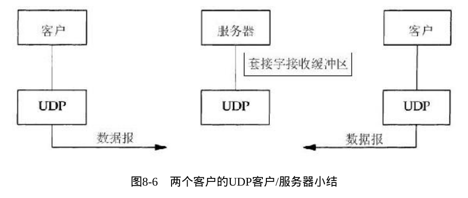

# UNIX网络编程：套接字概念、TCP与UDP编程模型

UNIX网络编程 卷1: 套接字联网API (第3版) 第2、3、4、5、8章

第二章讲述了传输层的基础概念，第三章介绍了套接字的地址结构与操作函数，第4章给出了tcp编程模型需要的函数，第五章实现了一个基础的Tcp服务器客户端程序，第八章介绍了UDP编程模型的函数与一个范例程序。

**略去了SCTP的内容**

- [UNIX网络编程：套接字概念、TCP与UDP编程模型](#unix网络编程套接字概念tcp与udp编程模型)
  - [第2章 传输层：TCP、UDP](#第2章-传输层tcpudp)
    - [概述与总览](#概述与总览)
    - [UDP](#udp)
    - [TCP](#tcp)
    - [TCP连接的建立和终止](#tcp连接的建立和终止)
      - [TCP连接建立——三路握手](#tcp连接建立三路握手)
      - [TCP选项](#tcp选项)
      - [TCP连接终止——四路握手](#tcp连接终止四路握手)
      - [TCP状态总览](#tcp状态总览)
    - [TIME\_WAIT状态](#time_wait状态)
    - [端口号](#端口号)
      - [标记通信位置的一组值——套接字](#标记通信位置的一组值套接字)
      - [TCP端口号与并发服务器（多个进程/线程用一个端口）](#tcp端口号与并发服务器多个进程线程用一个端口)
      - [缓冲区大小以及限制](#缓冲区大小以及限制)
  - [套接字的API](#套接字的api)
      - [IPv4套接字地址结构](#ipv4套接字地址结构)
      - [通用套接字地址结构](#通用套接字地址结构)
      - [IPv6套接字地址结构](#ipv6套接字地址结构)
      - [新的通用套接字地址结构](#新的通用套接字地址结构)
      - [套接字地址结构的比较](#套接字地址结构的比较)
    - [值—结果参数](#值结果参数)
      - [从进程到内核传递套接字地址结构的函数](#从进程到内核传递套接字地址结构的函数)
      - [从内核到进程传递套接字地址结构的函数](#从内核到进程传递套接字地址结构的函数)
    - [字节排序函数](#字节排序函数)
      - [在主机字节序和网络字节序之间相互转换](#在主机字节序和网络字节序之间相互转换)
    - [字节操纵函数](#字节操纵函数)
        - [`bzero`函数](#bzero函数)
    - [地址转换函数](#地址转换函数)
      - [在点分十进制数串（例如“206.168.112.96 ”）与它长度为32位的网络字节序二进制值间转换IPv4地址——`inet_aton/inet_addr /inet_ntoa`函数（不推荐使用）](#在点分十进制数串例如20616811296-与它长度为32位的网络字节序二进制值间转换ipv4地址inet_atoninet_addr-inet_ntoa函数不推荐使用)
      - [在点分十进制数串（例如“206.168.112.96 ”）与网络字节序二进制值间互相转换IPv4或IPv6地址——`inet_pton/inet_ntop` 函数](#在点分十进制数串例如20616811296-与网络字节序二进制值间互相转换ipv4或ipv6地址inet_ptoninet_ntop-函数)
    - [把一个本地协议地址赋予一个套接字——`bing`函数](#把一个本地协议地址赋予一个套接字bing函数)
    - [进入监听状态——`listen`函数](#进入监听状态listen函数)
      - [接受客户端连接请求——`accept` 函数](#接受客户端连接请求accept-函数)
    - [并发服务器程序前置之进程生灭——`fork`和`exec`函数](#并发服务器程序前置之进程生灭fork和exec函数)
    - [并发服务器](#并发服务器)
    - [关闭套接字，并终止 TCP 连接——`close` 函数](#关闭套接字并终止-tcp-连接close-函数)
    - [返回与套接字关联的协议地址——`getsockname/getpeername` 函数](#返回与套接字关联的协议地址getsocknamegetpeername-函数)
  - [TCP客户/服务程序示例](#tcp客户服务程序示例)
    - [程序的结构与分块说明](#程序的结构与分块说明)
      - [TCP回射服务器程序：`main`函数](#tcp回射服务器程序main函数)
      - [TCP回射服务器程序：`str_echo`函数](#tcp回射服务器程序str_echo函数)
      - [TCP回射客户程序：`main`函数](#tcp回射客户程序main函数)
      - [TCP回射客户程序：`str_cli`函数](#tcp回射客户程序str_cli函数)
    - [正常的运行流程](#正常的运行流程)
    - [正常的终止流程](#正常的终止流程)
    - [信号的处理](#信号的处理)
      - [wait和waitpid函数——调用了函数wait来处理已终止的子进程](#wait和waitpid函数调用了函数wait来处理已终止的子进程)
      - [服务器主机崩溃](#服务器主机崩溃)
      - [服务器主机崩溃后重启](#服务器主机崩溃后重启)
      - [服务器关机](#服务器关机)
      - [TCP程序例子小结](#tcp程序例子小结)
    - [数据格式](#数据格式)
  - [基本UDP套接字编程](#基本udp套接字编程)
    - [`recvfrom` 和`sendto` 函数](#recvfrom-和sendto-函数)
    - [UDP回射服务器程序:main函数](#udp回射服务器程序main函数)
    - [UDP回射服务器程序:`dg_echo`函数](#udp回射服务器程序dg_echo函数)
    - [UDP回射客户程序的main函数](#udp回射客户程序的main函数)
    - [UDP回射客户程序:`dg_cli`函数](#udp回射客户程序dg_cli函数)
      - [数据报的丢失](#数据报的丢失)
      - [验证接收到的响应](#验证接收到的响应)
      - [服务器进程未运行](#服务器进程未运行)
    - [UDP程序例子小结](#udp程序例子小结)
    - [UDP的connect函数](#udp的connect函数)
      - [给一个UDP套接字多次调用connect](#给一个udp套接字多次调用connect)
      - [性能](#性能)
    - [dg\_cli函数(修订版)](#dg_cli函数修订版)
    - [UDP缺乏流量控制](#udp缺乏流量控制)
    - [UDP中的外出接口的确定](#udp中的外出接口的确定)
      - [使用select函数的TCP和UDP回射服务器程序](#使用select函数的tcp和udp回射服务器程序)
    - [小结](#小结)


## 第2章 传输层：TCP、UDP

这里的介绍较为简略，更深层需要查阅之前的笔记

[`ComputerNetworkNotes`/计算机网络微课堂笔记第五章.md at main · `kagangtuya-star/ComputerNetworkNotes` · GitHub](https://github.com/kagangtuya-star/ComputerNetworkNotes/blob/main/计算机网络微课堂笔记第五章.md)

### 概述与总览

绝大多数客户/服务器网络应用使用TCP或UDP。

UDP是一个简单的、不可靠的数据报协议，而TCP是一个复杂、可靠的字节流协议。

TCP的某些特性一旦理解，就很容易编写健壮的客户和服务器程序，也很容易使用诸如netstat 等普遍可用的工具来调试客户和服务器程序。

- IPv4（通常称之为IP）自20世纪80年代早期以来一直是网际协议族的主力协议。它使用32位地址（见A.4节）。IPv4给TCP、UDP、SCTP、ICMP和IGMP提供分组递送服务。
- IPv6是在20世纪90年代中期作为IPv4的一个替代品设计的。其主要变化是使用128位更大地址（见A.5节）以应对20世纪90年代因特网的爆发性增长。IPv6给TCP、UDP、SCTP和ICMPv6提供分组递送服务。

TCP 传输控制协议 （Transmission Control Protocol）。TCP是一个面向连接的协议，为用户进程提供可靠的全双工字节流。TCP套接字是一种流套接字 （stream socket）。TCP关心确认、超时和重传之类的细节。大多数因特网应用程序使用TCP。注意，TCP既可以使用IPv4，也可以使用IPv6。

UDP 用户数据报协议 （User Datagram Protocol）。UDP是一个无连接协议。UDP套接字是一种数据报套接字 （datagram socket）。UDP数据报不能保证最终到达它们的目的地。与TCP一样，UDP既可以使用IPv4，也可以使用IPv6。

### UDP

UDP是一个简单的传输层协议。应用进程往一个UDP套接字写入一个消息，该消息随后被封装（encapsulating）到一个UDP数据报，该UDP数据报进而又被封装到一个IP数据报，然后发送到目的地。UDP不保证UDP数据报会到达其最终目的地，不保证各个数据报的先后顺序跨网络后保持不变，也不保证每个数据报只到达一次。

- UDP缺乏可靠性，无法自动重传丢失或错误的数据报。如果一个数据报到达了其最终目的地，但是校验和检测发现有错误，或者该数据报在网络传输途中被丢弃了，它就无法被投递给UDP套接字，也不会被源端自动重传。如果想要确保一个数据报到达其目的地，可以往应用程序中添置一大堆的特性：来自对端的确认、本端的超时与重传等。
- UDP数据报有长度，与数据一起传递给接收端应用进程。如果一个数据报正确地到达其目的地,那么该数据报的长度将随数据一道传递给接收端应用进程
- UDP是无连接的服务，一个UDP客户可以创建一个套接字并发送一个数据报给一个给定的服务器,然后立即用同一个套接字发送另一个数据报给另一个服务器。同样地,一个UDP服务器可以用同一个UDP套接字从若干个不同的客户接收数据报,每个客户一个数据报。

### TCP

TCP提供客户与服务器之间的连接 (connection)。TCP客户先与某个给定服务器建立一个连接,再跨该连接与那个服务器交换数据,然后终止这个连接。

- TCP提供了可靠性（数据的可靠递送或故障的可靠通知）。当TCP向另一端发送数据时,它要求对端返回一个确认。如果没有收到确认,TCP就自动重传数据并等待更长时间。在数次重传失败后,TCP才放弃。注意,TCP并不保证数据一定会被对方端点接收,因为这是不可能做到的。如果有可能,TCP就把数据递送到对方端点,否则就(通过放弃重传并中断连接这一手段)通知用户。
- TCP可以动态估算客户和服务器之间的往返时间`RTT`。
- TCP通过给其中每个字节关联一个序列号对所发送的数据进行排序 。
- TCP提供流量控制 (flow control)。TCP总是告知对端在任何时刻它一次能够从对端接收多少字节的数据。TCP提供流量控制，通过通告窗口告知对端在任何时刻它一次能够从对端接收多少字节的数据。通告窗口的大小时刻动态变化，指出接收缓冲区中当前可用的空间量，以确保发送端发送的数据不会使接收缓冲区溢出。当接收端应用从缓冲区中读取数据时，窗口大小增大，但窗口大小减小到0是有可能的，当TCP对应某个套接字的接收缓冲区已满导致它必须等待应用从该缓冲区读取数据时，才能从对端再接收数据。
- TCP连接是全双工的 (full-duplex)。这意味着在一个给定的连接上应用可以在任何时刻在进出两个方向上既发送数据又接收数据。因此,TCP必须为每个数据流方向跟踪诸如序列号和通告窗口大小等状态信息。

### TCP连接的建立和终止

#### TCP连接建立——三路握手

建立一个TCP连接时会发生下述情形。

1. 服务器必须准备好接受外来的连接。这通常通过调用socket 、bind 和listen 这3个函数来完成,我们称之为被动打开(passive open)。
2. 客户通过调用connect 发起主动打开 (active open)。这导致客户TCP发送一个SYN(同步)分节,它告诉服务器客户将在(待建立的)连接中发送的数据的初始序列号。通常SYN分节不携带数据,其所在IP数据报只含有一个IP首部、一个TCP首部及可能有的TCP选项(我们稍后讲解)。
3. 服务器必须确认(ACK)客户的SYN,同时自己也得发送一个SYN分节,它含有服务器将在同一连接中发送的数据的初始序列号。服务器在单个分节中发送SYN和对客户SYN的ACK(确认)。
4. 客户必须确认服务器的SYN。

这种交换至少需要3个分组,因此称之为TCP的三路握手 (three- way handshake)。


客户的初始序列号为J,服务器的初始序列号为K。ACK中的确认号是发送这个ACK的一端所期待的下一个序列号。因为SYN占据一个字节的序列号空间,所以每一个SYN的ACK中的确认号就是该SYN的初始序列号加1。类似地,每一个FIN(表示结束)的ACK中的确认号为该FIN的序列号加1。

建立TCP连接类似于打电话,`socket`函数相当于有电话可用,`bind`函数告诉别人你的电话号码,`listen`函数打开电话振铃,`connect`函数要求拨打对方电话,`accept`函数在连接建立后返回客户的标识,类似于电话的呼叫者ID功能部件。使用DNS提供电话簿服务,`getaddrinfo`类似于查找电话号码,`getnameinfo`则按照电话号码而不是用户名排序。

#### TCP选项

TCP的SYN可以含有多个选项,常用的包括MSS选项和窗口规模选项。MSS选项通告对端本连接的最大分节大小（它在本连接的每个TCP分节中愿意接受的最大数据量）,窗口规模选项指定通告窗口必须扩大的位数,以增加最大窗口大小。时间戳选项可防止数据损坏,但仅在高速网络连接中必要,不用考虑。

#### TCP连接终止——四路握手

TCP建立一个连接需3个分节,终止一个连接则需4个分节。

1. 某个应用进程首先调用close ,我们称该端执行主动关闭(active close)。该端的TCP于是发送一个FIN分节,表示数据发送完毕。
2. 接收到这个FIN的对端执行被动关闭 (passive close)。这个FIN由TCP确认。它的接收也作为一个文件结束符(end-of-file)传递给接收端应用进程(放在已排队等候该应用进程接收的任何其他数据之后),因为FIN的接收意味着接收端应用进程在相应连接上再无额外数据可接收。
3. 一段时间后,接收到这个文件结束符的应用进程将调用close 关闭它的套接字。这导致它的TCP也发送一个FIN。
4. 接收这个最终FIN的原发送端TCP(即执行主动关闭的那一端)确认这个FIN。

每个方向都需要一个FIN和一个ACK,因此通常需要4个分节。


类似SYN,一个FIN也占据1个字节的序列号空间。因此,每个FIN的ACK确认号就是这个FIN的序列号加1。

当套接字被关闭时,其所在端TCP各自发送了一个FIN。我们在图中指出,这是由应用进程调用close 而发生的,不过需认识到,当一个Unix进程无论自愿地(调用exit 或从main 函数返回)还是非自愿地(收到一个终止本进程的信号)终止时,所有打开的描述符都被关闭,这也导致仍然打开的任何TCP连接上也发出一个FIN。

无论是客户还是服务器,任何一端都可以执行主动关闭。通常情况是客户执行主动关闭,但是某些协议(譬如值得注意的HTTP/1.0)却由服务器执行主动关闭。

#### TCP状态总览


TCP为一个连接定义了11种状态,并且TCP规则规定如何基于当前状态及在该状态下所接收的分节从一个状态转换到另一个状态。举例来说,当某个应用进程在`CLOSED`状态下执行主动打开时,TCP将发送一个SYN,且新的状态是SYN_SENT。如果这个TCP接着接收到一个带ACK的SYN,它将发送一个ACK,且新的状态是`ESTABLISHED`。这个最终状态是绝大多数数据传送发生的状态。、

自`ESTABLISHED`状态引出的两个箭头处理连接的终止。如果某个应用进程在接收到一个FIN之前调用close (主动关闭),那就转换到`FIN_WAIT_1`状态。但如果某个应用进程在`ESTABLISHED`状态期间接收到一个FIN(被动关闭),那就转换到`CLOSE_WAIT`状态。

下面是一个完整的TCP连接所发生的实际分组交换情况，包括连接建立、数据传送和连接终止。


一旦建立TCP连接，客户端向服务器发送请求并收到应答。如果请求和应答都很小，可以在单个TCP分节中发送和接收。在TCP中，确认通常随着应答一起发送，这种做法称为捎带（piggybacking）。终止连接需要发送四个分节，并且主动关闭一端（例如客户端）会进入TIME_WAIT状态。 TCP的开销比UDP大，但TCP提供了可靠性和拥塞控制等重要功能。一些网络应用使用UDP，因为它避免了TCP连接建立和终止所需的开销，但是需要应用层处理可靠性和拥塞控制。

### TIME_WAIT状态

TCP中的TIME_WAIT状态是网络编程中最难理解的部分之一。当一端执行主动关闭时，它会进入TIME_WAIT状态，这个状态持续的时间是最长分节生命周期（`MSL`）的两倍，通常被称为2MSL。每个TCP实现必须选择一个`MSL`的值。RFC 1122建议的值是2分钟，但Berkeley的实现传统上使用30秒的值。因此，TIME_WAIT状态的持续时间在1分钟到4分钟之间。

`MSL`是任何IP数据报在因特网中存活的最长时间。每个数据报都包含一个8位字段，称为跳限或TTL（生存时间），它的最大值为255。尽管这是一个跳数限制而不是真正的时间限制，但我们假设：具有最大跳数限制的分组在网络中存在的时间不可能超过`MSL`秒。

分组在网络中“迷途”通常是路由异常的结果。如果路由器崩溃或两个路由器之间的链路断开，路由协议需要数秒钟到数分钟的时间来稳定并找到另一条通路。在这段时间内，可能会发生路由循环，导致我们关心的分组陷入其中。如果迷途的分组是一个TCP分节，发送端TCP可能会超时并重传该分节，而重传的分节可能通过某条候选路径到达最终目的地。但是在最多`MSL`秒之后，路由循环可能会修复，之前迷失在这个循环中的分组最终也被送到目的地。这个原来的分组称为迷途的重复分组或漫游的重复分组。TCP必须正确处理这些重复的分组，以保证数据的可靠传输。

### 端口号

在任何时候，多个进程可能同时使用TCP、UDP和SCTP这三种传输层协议之一。这三种协议都使用16位整数的端口号来区分这些进程。

当一个客户端想要与一个服务器建立连接时，它必须标识要与之通信的这个服务器。TCP、UDP和SCTP定义了一组众所周知的端口，用于标识众所周知的服务。例如，支持FTP的所有TCP/IP实现都将21这个众所周知的端口分配给FTP服务器。而分配给简化文件传输协议（TFTP）的是UDP端口号69。

另一方面，客户端通常使用短期存活的临时端口。这些端口号通常由传输层协议自动分配给客户端。客户端通常不关心其临时端口的具体值，只需确保该端口在所在主机中是唯一的即可。传输协议的代码会确保这种唯一性。

端口号的一般划分如下


端口号被划分成以下三段：

- 众所周知的端口为0~1023。这些端口由IANA分配和控制。如果可能的话，相同的端口号将被分配给TCP、UDP和SCTP的同一给定服务。例如，TCP和UDP都使用端口号80来标识Web服务器，尽管目前所有的实现都只使用TCP。

- 已登记的端口为1024~49151。这些端口不受IANA控制，但是IANA会登记并提供这些端口的使用情况清单，以方便整个群体。如果可能的话，相同的端口号也将被分配给TCP和UDP的同一给定服务。例如，端口号6000~6063被分配给TCP和UDP的X Window服务器，尽管目前所有的实现都只使用TCP。引入49151作为上限是为了给临时端口留出空间，而RFC 1700中列出的上限为65535。

- 49152~65535是动态或私有端口。IANA不控制这些端口。它们被称为临时端口。49152这个数字是65536的四分之三。

Unix系统有保留端口 (reserved port)的概念,指的是小于1024的任何端口。这些端口只能赋予特权用户进程的套接字。所有IANA 众所周知的端口都是保留端口,分配使用这些端口的服务器(例如FTP服务器)必须以超级用户特权启动。

#### 标记通信位置的一组值——套接字

套接字是用于标识网络上的通信端点的一组值，包括IP地址和端口号。在TCP连接中，套接字对是一个四元组，包括本地IP地址、本地TCP端口号、远程IP地址和远程TCP端口号，唯一标识每个连接。

对于SCTP，套接字对的概念与TCP相同，但是一个关联可能需要多个四元组标识，特别是在其中一个端点是多宿的情况下。每个端点由一组IP地址和一个端口号标识。

即使UDP是无连接的，我们仍然可以将套接字对的概念应用于它。在讲解套接字函数（如`bind`、`connect`、`getpeername`等）时，我们需要指定套接字对中的哪些值。例如，bind函数要求应用程序为TCP、UDP或SCTP套接字指定本地IP地址和本地端口号。

#### TCP端口号与并发服务器（多个进程/线程用一个端口）

TCP无法仅仅通过查看目的端口号来分离外来的分节到不同的端点。它必须查看套接字对的所有4个元素才能确定由哪个端点接收某个到达的分节。


图中，对于同一个本地端口(21) 存在3个套接字。如果一个分节来自206.168.112.219端口1500,目的地为12.106.32.254端口21,它就被递送给第一个子进程。如果一个分节来自206.168.112.219端口1501,目的地为12.106.32.254端口21,它就被递送给第二个子进程。所有目的端口为21的其他TCP分节都被递送给拥有监听套接字的最初那个服务器(父进程)。

#### 缓冲区大小以及限制

IP数据报大小存在着各种各样的最大大小，有的是标准规定的，如IPv4数据报，有的是硬件需求规定的，如MTU。

当一个IP数据报将从某个接口送出时,如果它的大小超过相应链路的MTU,IPv4和IPv6都将执行分片 (fragmentation)。这些片段在到达最终目的地之前通常不会被重组 (reassembling)。

IPv4和IPv6都定义了最小重组缓冲区大小 (minimum reassembly buffer size),它是IPv4或IPv6的任何实现都必须保证支持的最小数据报大小。

TCP有一个MSS(maximum segment size,最大分节大小),用于向对端TCP通告对端在每个分节中能发送的最大TCP数据量。

...

## 套接字的API

大多数套接字函数都需要一个指向套接字地址结构的指针作为参数。每个协议族都定义它自己的套接字地址结构。这些结构的名字均以`sockaddr_` 开头,并以对应每个协议族的唯一后缀结尾

#### IPv4套接字地址结构

Pv4套接字地址结构通常也称为“网际套接字地址结构”,它以`sockaddr_in` 命名,定义在`<netinet/in.h>` 头文件中。

```
struct in_addr {
    in_addr_t s_addr;  // 32-bit IPv4 address, network byte ordered
};

struct sockaddr_in {
    uint8_t sin_len;        // length of structure (16)
    sa_family_t sin_family; // AF_INET
    in_port_t sin_port;     // 16-bit TCP or UDP port number, network byte ordered
    struct in_addr sin_addr;// 32-bit IPv4 address, network byte ordered
    char sin_zero[8];       // unused
};
```

 `sin_len`

表示结构体的长度,通常设置为16。这是为增加对OSI协议的支持而随4.3BSD-Reno添加的。在此之前,第一个成员是sin_family,它是一个无符号短整数(unsigned short)。

并不是所有的厂家都支持套接字地址结构的长度字段,而且POSIX规范也不要求有这个成员。
该成员的数据类型uint8_t是典型的,符合POSIX的系统都提供这种形式的数据类型。
有了长度字段,才简化了长度可变套接字地址结构的处理。

即使有长度字段,我们也无须设置和检查它,除非涉及路由套接字。它是由处理来自不同协议族的套接字地址结构的例程(例如路由表处理代码)在内核中使用的。

`sin_family`

表示地址族,通常设置为 AF_INET,表示IPv4地址族。


`sin_port`

表示端口号,是一个16位的无符号整数,使用网络字节序(大端序)表示

 `in_addr` `sin_addr`

表示IP地址,是一个32位的无符号整数,同样使用网络字节序表示。32位IPv4地址存在两种不同的访问方法。如果`serv`定义为某个网际套接字地址结构,那么`serv.sin_addr`将按`in_addr`结构引用其中的32位IPv4地址,而`serv.sin_addr.s_addr`将按`in_addr_t`(通常是一个无符号的32位整数)引用同一个32位IPv4地址。

`in_addr` 

结构体表示一个32位的IPv4地址,包含一个无符号整数 `s_addr`,使用网络字节序(大端序)表示。`sockaddr_in` 结构体则表示一个IPv4套接字地址,包含了地址族、端口号和IP地址三个重要的信息

`sin_zero`[8]:是一个8字节的填充字段,在协议中没有实际用途,仅用于对齐。


必须正确地使用IPv4地址,尤其是在将它作为函数的参数时,因为编译器对传递结构和传递整数的处理是完全不同的。

POSIX规范只需要这个结构中的3个字段:`sin_family`、`sin_addr`和`sin_port`。对于符合POSIX的实现来说,定义额外的结构字段是可以接受的,这对于网际套接字地址结构来说也是正常的。几乎所有的实现都增加了sin_zero字段,所以所有的套接字地址结构大小都至少是16字节。

IPv4地址和TCP或UDP端口号在套接字地址结构中总是以网络字节序来存储。在使用这些字段时,我们必须牢记这一点。

**套接字地址结构仅在给定主机上使用:**虽然结构中的某些字段(例如IP地址和端口号)用在不同主机之间的通信中,但是结构本身并不在主机之间传递。

#### 通用套接字地址结构

其作用为对指向特定于协议的套接字地址结构的指针执行类型强制转换。

```
struct sockaddr{
    uint8_t        sa_len;
    sa_family_t    sa_family;   /*address family：AF_XXX value*/
    char           sa_data[14]; /*protocol-specific address*/
}
```

当作为一个参数传递进任何套接字函数时,套接字地址结构总是以**引用形式(也就是以指向该结构的指针)**来传递。

以这样的指针作为参数之一的任何套接字函数**必须处理来自所支持的任何协议族的套接字地址结构。**

在如何声明所传递指针的数据类型上存在一个问题。有了`ANSI C`后解决办法很简单:`void *`是通用的指针类型。然而套接字函数是在`ANSI C`之前定义的,采取的办法是在`<sys/socket.h>`头文件中定义一个通用的套接字地址结构。

下面是一个简单的示例

```
int bind(int,struct sockaddr *,socklen_t);

struct sockaddr_int serv;
bind(sockfd,(struct sockaddr*)&serv,sizeof(serv));
//  bind 函数调用将 sockfd 文件描述符绑定到一个IPv4套接字地址 serv 上,serv 是一个 struct sockaddr_in 结构体类型的变量,其中包含了要绑定的地址和端口信息。bind 函数的第二个参数是指向 struct sockaddr 结构体的指针,需要将 serv 的地址强制转换为 struct sockaddr 的指针类型,即 (struct sockaddr*)&serv,这样才能作为 bind 函数的参数传入。第三个参数是 serv 结构体的大小,可以使用 sizeof 运算符获取。
```

#### IPv6套接字地址结构

IPv6套接字地址结构是用来表示IPv6地址和端口号的数据结构,它定义在头文件`<netinet/in.h>`中。

```
struct in6_addr{
    unit8_t    s6_addr[16];    /*s128-bit IPv6 address*/
                               /*network byte ordered*/
};
 
#define SIN6_LEN    /*required for compile-time tests*/
 
struct sockaddr_in6{
    uint8_t         sin6_len;      /*length of this struct (28)*/
    sa_family_t     sin6_family;   /*AF_INET6*/
    in_port_t       sin6_port;     /*transport layer port*/
                                   /*network byte ordered*/
    uint32_t        sin6_flowinfo; /*flow information,undefined*/
    struct in6_addr sin6_addr;     /*IPv6 address*/
                                   /*network byte ordered*/
    uint32_t        sin6_scope_id; /*set of interfaces for a scope*/
};
```

`sin6_len`: 一个8位的字段,表示IPv6套接字地址结构的长度,单位为字节。在IPv6套接字地址结构中,`sin6_len`的值为28。
`sin6_family`: 一个16位的字段,表示地址族,它的值为AF_INET6,表示IPv6地址族。
`sin6_port`: 一个16位的字段,表示传输层端口号,它的值是网络字节序(big-endian)的。对于TCP或UDP套接字,该字段必须在调用bind()函数时设置,一般使用`htons`()函数将主机字节序转换为网络字节序。
`sin6_flowinfo`: 一个32位的字段,用于指定流信息,目前该字段尚未定义,应该设置为0。
`sin6_addr`: 一个128位的IPv6地址,存储在一个长度为16字节的数组s6_addr中,每个字节都是网络字节序的。IPv6地址的表示方法是8个16位的整数,每个整数使用16进制表示,各整数之间用冒号分隔,例如:2001:0db8:85a3:0000:0000:8a2e:0370:7334。
`sin6_scope_id`: 一个32位的字段,用于指定地址的范围,当使用链路本地地址或站点本地地址时,该字段必须设置为相应的接口索引号。对于全局地址,该字段应设置为0。

注意

- 如果系统支持套接字地址结构中的长度字段,那么`SIN6_LEN`常值必须定义。
- IPv6的地址族是AF_INET6,而IPv4的地址族是AF_INET。
- 结构中字段的先后顺序做过编排,使得如果`sockaddr_in6`结构本身是64位对齐的,那么128位的`sin6_addr`字段也是64位对齐的。在一些64位处理机上,如果64位数据存储在某个64位边界位置,那么对它的访问将得到优化处理。
- `sin6_flowinfo`字段分成两个字段:低序20位是流标(flow label);高序12位保留。
- 对于具备范围的地址(scoped `address`),`sin6_scope_id`字段标识其范围(scope),最常见的是链路局部地址(link-local address)的接口索引(interface index))。

#### 新的通用套接字地址结构

```
struct sockaddr_storage{
    uint8_t     ss_len;    /*length of thos struct (implementation dependent)*/
    sa_family_t ss_familt; /*address family;AF_XXX value*/
}
```

作为IPv6套接字API的一部分而定义的新的通用套接字地址结构克服了现有struct sockaddr 的一些缺点。不像struct sockaddr ,新的struct sockaddr_storage 足以容纳系统所支持的任何套接字地址结构。

- 如果系统支持的任何套接字地址结构有对齐需要,那么`sockaddr_storage`能够满足最苛刻的对齐要求。
- `sockaddr_storage`足够大,能够容纳系统支持的任何套接字地址结构。

除了`ss_family`和`ss_len`外(如果有的话),`sockaddr_storage`结构中的其他字段对用户来说是透明的。
`sockaddr_storage`结构必须类型强制转换成或复制到适合于`ss_family`字段所给出地址类型的套接字地址结构中,才能访问其他字段。

#### 套接字地址结构的比较

在套接字编程中,不同类型的套接字地址结构有不同的长度。为了处理长度可变的结构,我们需要在传递指向套接字地址结构的指针时,同时传递该结构的长度作为另一个参数给套接字函数。这个长度字段可以用一个单字节的字节表示,而地址族字段也占用一个字节。

IPv4和IPv6结构是固定长度的,所以在使用这些结构时,我们不需要传递额外的长度参数给套接字函数。但是,Unix域结构和数据链路结构是可变长度的,因此我们需要小心处理长度字段,包括套接字地址结构本身的长度字段(如果实现支持)以及作为参数传递给内核或从内核返回的长度。

虽然`sockaddr_un`结构本身的长度是固定的,但是其中的路径名长度是可变的。因此,在传递指向`sockaddr_un`结构的指针时,我们仍然需要传递该结构的长度作为另一个参数给套接字函数,以便正确处理路径名长度。

在4.3BSD Reno版本中,长度字段被引入到所有套接字地址结构中。如果套接字API的原始版本提供了长度字段,那么所有套接字函数就不再需要长度参数,例如`bind`和`connect`函数的第三个参数。相反,结构的大小可以包含在结构的长度字段中。


### 值—结果参数

当往一个套接字函数传递一个套接字地址结构时,该结构总是以引用形式来传递,也就是说传递的是指向该结构的一个指针。该结构的长度也作为一个参数来传递,不过其传递方式取决于该结构的传递方向:是从进程到内核,还是从内核到进程。

换句话说,当传递一个套接字地址给套接字函数时,实际上传递的是这个地址结构的指针,而不是整个结构本身。同时,为了确保内核和进程之间传递的数据是一致的,这个结构的长度也需要同时传递,并根据数据传递方向的不同采用不同的传递方式。

#### 从进程到内核传递套接字地址结构的函数

`bind`、`connect`和`sendto` 这些函数的一个参数是指向某个套接字地址结构的指针,另一个参数是该结构的整数大小。这些函数的一个参数是指向某个套接字地址结构的指针,另一个参数是该结构的整数大小。如下：

```
struct sockaddr_in serv;
/* fill in serv{} */
connect(sockfd, (SA *) &serv, sizeof(serv));
```

指针和指针所指内容的大小都传递给了内核,于是内核知道到底需从进程复制多少数据进来。


#### 从内核到进程传递套接字地址结构的函数

`accept`、`recvfrom`、`getsockname`和`getpeername`这4个函数的其中两个参数是指向某个套接字地址结构的指针和指向表示该结构大小的整数变量的指针。

```
struct sockaddr_un cli; /* Unix domain */
socklen_t len;
len = sizeof(cli); /* len is a value */
getpeername(unixfd, (SA *) &cli, &len);
/* len may have changed */
```

把套接字地址结构大小这个参数从一个整数改为指向某个整数变量的指针,其原因在于:

- 当函数被调用时,结构大小是一个值(value),它告诉内核该结构的大小,这样内核在写该结构时不至于越界;
- 当函数返回时,结构大小又是一个结果(result),它告诉进程内核在该结构中究竟存储了多少信息。

这种类型的参数称为值—结果(value-result)参数。


当使用值—结果参数作为套接字地址结构的长度时,如果套接字地址结构是固定长度的,那么从内核返回的值总是那个固定长度,例如IPv4的`sockaddr_in`长度是16,IPv6的`sockaddr_in6`长度是28。然而对于可变长度的套接字地址结构(例如Unix域的`sockaddr_un`),返回值可能小于该结构的最大长度。

在网络编程中,值—结果参数最常见的例子是所返回套接字地址结构的长度。还会碰到其他值—结果参数:

- `select`函数中间的3个参数
- `getsockopt`函数的长度参数
- 使用`recvmsg`函数时,`msghdr`结构中的`msg_namelen`和`msg_controllen`字段
- `ifconf`结构中的`ifc_len`字段
- `sysctl`函数两个长度参数中的第一个

### 字节排序函数

一个16位整数,它由2个字节组成。内存中存储这两个字节有两种方法：

- 将低序字节存储在起始地址,这称为小端(little-endian)字节序
- 将高序字节存储在起始地址,这称为大端(big-endian)字节序。

“小端”和“大端”表示多个字节值的哪一端(小端或大端)存储在该值的起始地址。把某个给定系统所用的字节序称为主机字节序(host byteorder)。


检验大小端测试:在一个短整数变量中存放2字节的值0x0102,然后查看它的两个连续字节c[0] (对应图地址A)和c[1] (对应图中的地址A+1),以此确定字节序。
字符串CPU_VENDOR_OS是由GNU的`autoconf`程序在配置本书中的软件时确定的,它标识CPU类型、厂家和操作系统版本。

```
int main(int argc, char **argv)
{
    union {
        short  s;
        char   c[sizeof(short)];
    } un;
 
    un.s = 0x0102;
    printf("%s: ", CPU_VENDOR_OS);
    if (sizeof(short) == 2) {
        if (un.c[0] == 1 && un.c[1] == 2)
            printf("big-endian\n");
        else if (un.c[0] == 2 && un.c[1] == 1)
            printf("little-endian\n");
        else
            printf("unknown\n");
    } else
        printf("sizeof(short) = %d\n", sizeof(short));
 
    exit(0);
}
```

#### 在主机字节序和网络字节序之间相互转换

由于历史的原因和POSIX规范的规定,套接字地址结构中的某些字段必须按照网络字节序进行维护。因此要关注如何在主机字节序和网络字节序之间相互转换。

`htons`和`htonl`函数将主机字节序的值转换为网络字节序的值,而`ntohs`和`ntohl`函数将网络字节序的值转换为主机字节序的值,以便在不同计算机之间进行正确的数据传输。

使用这些函数时,我们并不关心主机字节序和网络字节序的真实值(或为大端,或为小端)。我们所要做的只是调用适当的函数在主机和网络字节序之间转换某个给定值。在那些与网际协议所用字节序(大端)相同的系统中,这四个函数通常被定义为空宏。

```
#include<netinet/in.h>
uint16_t htons(uint16_t host16bitvalue);
uint32_t htonl(uint32_t host32bitvalue);  //均返回：网络字节序的值
uint16_t ntohs(uint16_t net16bitvalue);
uint32_t ntohl(uint32_t net32bitvalue);   //均返回：主机字节序的值
```

**参数**

`host16bitvalue`:一个16位的主机字节序的值。
`host32bitvalue`:一个32位的主机字节序的值。
`net16bitvalue` :一个16位的网络字节序的值。
`net32bitvalue` :一个32位的网络字节序的值。
**返回值**

`htons`和`htonl`函数返回一个网络字节序的值,该值是将主机字节序的16位或32位值转换为网络字节序的结果。
`ntohs`和`ntohl`函数返回一个主机字节序的值,该值是将网络字节序的16位或32位值转换为主机字节序的结果。

### 字节操纵函数

字节操纵函数用于处理以空字符结尾的C字符串，这些函数是由在<`string.h`>头文件中定义、名字以str(表示字符串)开头的函数处理的。

历史上，名字以b(表示字节)开头的第一组函数起源于4.2BSD,几乎所有现今支持套接字函数的系统仍然提供它们。名字以mem(表示内存)开头的第二组函数起源于ANSI C标准,支持ANSI C函数库的所有系统都提供它们。

```
#include <strings.h>
void bzero(void *dest, size_t nbytes);
void bcopy(const void *src, void *dest, size_t nbytes);
int bcmp(const void *ptr1, const void *ptr2, size_t nbytes); 

void *memset(void *dest, int c, size_t len);
void *memcpy(void *dest, const void *src, size_t nbytes);
int memcmp(const void *ptr1, const void *ptr2, size_t nbytes); 
```

##### `bzero`函数

**参数**

`dest`：指向要清零的内存区域的指针

`nbytes`：要清零的字节数

**返回值**

无返回值

**作用**

将 `dest` 指向的内存区域的前 nbytes 个字节清零，即设置为0。

memcmp比较两个任意的字节串，若相同则返回0，否则返回一个非0值，是大于0还是小于0则取决于第一个不等的字节：

- 如果ptr1所指字节串中的这个字节大于ptr2所指字节中的对应字节，那么大于0，否则小于0
- 比较操作是在假设两个不等的字节均为无符号字符（unsigned char）的前提下完成的。

**`bcopy`函数**

**参数**

`src`：指向源内存区域的指针

`dest`：指向目标内存区域的指针

`nbytes`：要复制的字节数

**返回值**

无返回值

**作用**

将 src 指向的内存区域的前 nbytes 个字节复制到 dest 指向的内存区域。


**`bcmp`函数**

参数：

`ptr1`：指向第一个内存区域的指针

`ptr2`：指向第二个内存区域的指针

`nbytes`：要比较的字节数

**返回值**

若两个内存区域的前 nbytes 个字节相等，则返回0；否则返回非0值。

**作用**

比较 ptr1 指向的内存区域和 ptr2 指向的内存区域的前 nbytes 个字节是否相等。


`memset`**函数**

参数：

`dest`：指向要填充的内存区域的指针

`c`：要填充的字节值

`len`：要填充的字节数

**返回值**

返回指向填充后的内存区域的指针。

**作用**

将 `dest` 指向的内存区域的前 len 个字节全部设置为 c。

记住memset最后两个参数顺序的方法之一是认识到所有ANSI C的memXXX函数都需要一个长度参数,而且它总是最后一个参数。

`memcpy`**函数**

**参数**

`dest`：指向目标内存区域的指针

`src`：指向源内存区域的指针

`nbytes`：要复制的字节数

**返回值**

返回指向目标内存区域的指针。

**作用**

将 src 指向的内存区域的前 nbytes 个字节复制到 dest 指向的内存区域。

memcpy类似bcopy,不过两个指针参数的顺序是相反的。

当源字节串与目标字节串重叠时,bcopy能够正确处理,但是memcpy的操作结果却不可知。这种情形下必须改用ANSI C的memmove函数。

记住`memcpy`两个指针参数顺序的方法之一是记着它们是按照与C中的赋值语句相同的顺序从左到右书写的:`dest = src;`

`memcmp`**函数**

**参数**

`ptr1`：指向第一个内存区域的指针

`ptr2`：指向第二个内存区域的指针

`nbytes`：要比较的字节数

**返回值**

若两个内存区域的前 nbytes 个字节相等，则返回0；若第一个内存区域的对应字节值小于第二个，则返回负值；否则返回正值。

**作用**

比较 ptr1 指向的内存区域和 ptr2 指向的内存区域的前 nbytes 个字节大小。

### 地址转换函数

在ASCII字符串(这是人们偏爱使用的格式)与网络字节序的二进制值 (这是存放在套接字地址结构中的值)之间转换网际地址。

#### 在点分十进制数串（例如“206.168.112.96 ”）与它长度为32位的网络字节序二进制值间转换IPv4地址——`inet_aton/inet_addr /inet_ntoa`函数（不推荐使用）

```
#include <arpa/inet.h>

int inet_aton(const char *strptr, struct in_addr *addrptr);
in_addr_t inet_addr(const char *strptr);
char *inet_ntoa(struct in_addr inaddr);

// 将一个IPv4地址字符串转换成网络字节序的二进制IP地址
// strptr - 要转换的IPv4地址字符串
// addrptr - 存储转换后的二进制IP地址的结构体指针
// 返回值 - 转换成功返回1，否则返回0
int inet_aton(const char *strptr, struct in_addr *addrptr);

// 将一个IPv4地址字符串转换成32位网络字节序的二进制IP地址
// strptr - 要转换的IPv4地址字符串
// 返回值 - 转换成功返回32位网络字节序的二进制IP地址，否则返回INADDR_NONE
in_addr_t inet_addr(const char *strptr);

// 将一个32位网络字节序的二进制IP地址转换成点分十进制数串
// inaddr - 要转换成点分十进制数串的二进制IP地址
// 返回值 - 指向点分十进制数串的指针
char *inet_ntoa(struct in_addr inaddr);
```

**`inet_aton`：**将strptr所指C字符串转换成一个32位的网络字节序二进制值，并通过指针addrptr来存储。若成功则返回1，否则返回0。

**`inet_addr`：**进行相同的转换，返回值为32位的网络字节序二进制值。该函数存在一个问题:所有232个可能的二进制值都是有效的IP地址 (从0.0.0.0到255255.255.255)，但是当出错时该数返回INADDR_NONE常值 (通常是一个32位均为1的值)。这意味着点分十进制数串255.255.255.255(这是IP4的有限广播地址)不能由该函数处理因为它的二进制值 被用来指示该函数失败。

**`inet_ntoa`：**函数将一个32位的网络字节序二进制IPv4地址转换成相应的点分十进制数串。

如今`inet_addr` 已被废弃,新的代码应该改用`inet_aton` 函数。但最好用下一节的新函数。

#### 在点分十进制数串（例如“206.168.112.96 ”）与网络字节序二进制值间互相转换IPv4或IPv6地址——`inet_pton/inet_ntop` 函数

函数名中p 和n 分别代表表达（presentation）和数值 （numeric）,地址的表达格式通常是ASCII字符串，数值格式则是存放到套接字地址结构中的二进制值。

```
include <arpa/inet.h>
int inet_pton(int family, const char *strptr, void *addrptr);

const char *inet_ntop(int family, const void *addrptr, char *strptr, size_t len);
```

**`inet_pton`函数**

**作用**

将字符串形式的IP地址转换为二进制形式，并存储到`addrptr`指向的内存中。

**参数**

- `family`：表示IP地址族，可取`AF_INET`或`AF_INET6`，分别表示IPv4和IPv6。
- `strptr`：指向字符串形式的IP地址的指针。
- `addrptr`：指向存储转换结果的内存的指针。

**返回值**

- 若成功则返回1。
- 若输入不是有效的表达格式则返回0。
- 若出错则返回-1。

---

**`inet_ntop`函数**

**作用**

将二进制形式的IP地址转换为字符串形式，并存储到`strptr`指向的内存中。

**参数**

- `family`：表示IP地址族，可取`AF_INET`或`AF_INET6`，分别表示IPv4和IPv6。
- `addrptr`：指向二进制形式的IP地址的指针。
- `strptr`：指向存储转换结果的内存的指针。
- `len`：表示存储转换结果的内存的大小，以免该函数溢出其调用者的缓冲区。为有助于指定这个大小，在`<netinet/in.h>`头文件中有如下定义

- ```
  #define INET_ADDRSTRLEN 16 /* for IPv4 dotted-decimal */
  #define INET6_ADDRSTRLEN 46 /* for IPv6 hex string */
  ```

**返回值**

- 若成功则返回指向结果的指针。
- 若出错则返回NULL。


### 获取套接字结构中指向某个二进制地址的指针——`sock_ntop` 和相关函数

`inet_ntop`的一个基本问题是:它要求调用者传递一个指向某个二进制地址的指针，而该地址通常包含在一个套接字地址结构中，这就要求调用者必须知道这个结构的格式和地址族。

为了使用这个函数，我们必须为编写如下代码

```
struct sockaddr_in addr;
inet_ntop(AF_INET, &addr.sin_addr, str, sizeof(str));// ipv4

struct sockaddr_in6 addr6;
inet_ntop(AF_INET6, &addr6.sin6_addr, str, sizeof(str)); // ipv6
```

为了解决这个问题，可以自行编写一个名为`sock_ntop` 的函数，它以指向某个套接字地址结构的指针为参数，查看该结构的内部，然后调用适当的函数返回该地址的表达格式

```
#include "unp.h"
char *sock_ntop(const struct sockaddr *sockaddr, socklen_t addrlen);
// 返回：若成功则为非空指针，若出错则为NULL
```

`sockaddr` 指向一个长度为`addrlen` 的套接字地址结构。本函数用它自己的静态缓冲区来保存结果，而指向该缓冲区的一个指针就是它的返回值。

```
int sock_bind_wild(int sockfd, int family);
int sock_cmp_addr(const struct sockaddr *sockaddr1, const struct sockaddr *sockaddr2, socklen_t addrlen);
int sock_cmp_port(const struct sockaddr *sockaddr1, const struct sockaddr *sockaddr2, socklen_t addrlen);
int sock_get_port(const struct sockaddr *sockaddr, socklen_t addrlen);
char *sock_ntop_host(const struct sockaddr *sockaddr, socklen_t addrlen);
void sock_set_addr(const struct sockaddr *sockaddr, socklen_t addrlen, void *ptr);
void sock_set_port(const struct sockaddr *sockaddr, socklen_t addrlen, int port);
void sock_set_wild(struct sockaddr *sockaddr, socklen_t addrlen);
```

**`sock_bind_wild`：**将通配地址和一个临时端口捆绑到一个套接字。

**`sock_cmp_addr`：**比较两个套接字地址结构的地址部分。

**`sock_cmp_port`：**则比较两个套接字地址结构的端口号部分。

**`sock_get_port`：**只返回端口号。

**`sock_ntop_host`：**把一个套接字地址结构中的主机部分转换成表达格式(不包括端口号)。

**`sock_set_addr`：**把一个套接字地址结构中的地址部分置为ptr指针所指的值;sock_set_port则只设置一个套接字地址结构的端口号部分。

**`sock_set_wild`：**把一个套接字地址结构中的地址部分置为通配地址。

跟本书所有函数一样，**我们也为那些返回值不是void的上述函数提供了包裹函数，它们的名字以s开头**，我们的程序通常调用这些包裹函数。

### `readn` 、`writen` 和`readline` 函数

字节流套接字(例如TCP套接字)上的read和write函数所表现的行为不同于通常的文件I/O。字节流套接字上调用read或write输入或输出的字节数可能比请求的数量少，然而这不是出错的状态。这个现象的原因在于内核中用于套接字的缓冲区可能已达到了极限。此时所需的是调用者再次调用read或write函数，以输入或输出剩余的字节。有些版本的Unix在往一个管道中写多于4096字节的数据时也会表现出这样的行为。这个现象在读一个字节流套接字时很常见，但是在写一个字节流套接字时只能在该套接字为非阻塞的前提下才出现。尽管如此，为预防万一，不让实现返回一个不足的字节计数值，我们总是改为调用writen函数来取代write函数。

**`readn`函数**

函数作用：从文件描述符`fd`指向的文件或套接字中读取`count`个字节，存放到缓冲区`buf`中。

参数：

- `fd`：文件描述符，可以是普通文件描述符、套接字描述符等。
- `buf`：存放读取数据的缓冲区。
- `count`：期望读取的字节数。

返回值：返回实际读取的字节数，如果返回值小于`count`，表示读取过程中遇到了文件结束或错误。

```
int readn(int fd, void *vptr, size_t n)
{
    size_t          nleft = n;           //readn函数还需要读的字节数
    ssize_t         nread = 0;           //read函数读到的字节数
    unsigned char   *ptr = (char *)vptr; //指向缓冲区的指针

    while (nleft > 0)
    {
        nread = read(fd, ptr, nleft);
        if (-1 == nread)
        {
            if (EINTR == errno)
                nread = 0;
            else
                return -1;
        }
        else if (0 == nread)
        {
            break;
        }
        nleft -= nread;
        ptr += nread;
    }
    return n - nleft;
}
```

`writen`函数

函数作用：将缓冲区`buf`中的`count`个字节写入到文件描述符`fd`指向的文件或套接字中。

参数：

- `fd`：文件描述符，可以是普通文件描述符、套接字描述符等。
- `buf`：存放待写入数据的缓冲区。
- `count`：待写入的字节数。

返回值：返回实际写入的字节数，如果返回值小于`count`，表示写入过程中遇到了错误。

```
int writen(int fd, const void *vptr, size_t n)
{
    size_t          nleft = n;  //writen函数还需要写的字节数
    ssize_t         nwrite = 0; //write函数本次向fd写的字节数
    const char*     ptr = vptr; //指向缓冲区的指针

    while (nleft > 0)
    {
        if ((nwrite = write(fd, ptr, nleft)) <= 0)
        {
            if (nwrite < 0 && EINTR == errno)
                nwrite = 0;
            else
                return -1;
        }
        nleft -= nwrite;
        ptr += nwrite;
    }
    return n;
}
```

`readline`函数

函数作用：从文件描述符`fd`指向的套接字中读取一行数据，存放到缓冲区`buf`中，最多读取`maxlen`个字节。

参数：

- `fd`：套接字描述符。
- `buf`：存放读取数据的缓冲区。
- `maxlen`：缓冲区的最大长度。

返回值：返回实际读取的字节数，如果返回值为0，表示对端已经关闭连接；如果返回值小于0，表示读取过程中遇到了错误。读取到的数据不包含行结束符（例如`'\n'`），需要自行添加。

```
static ssize_t readch(int fd, char *ptr)
{
    static int          count = 0;
    static char*        read_ptr = 0;
    static char         read_buf[1024*4] = {0};

    if (count <= 0)
    {
    again:
        count = read(fd, read_buf, sizeof(read_buf));
        if (-1 == count)
            if (EINTR == errno)
                goto again;
            else
                return -1;
        else if (0 == count)
            return 0;
        read_ptr = read_buf;
    }
    count--;
    *ptr = *read_ptr++;
    return 1;
}

ssize_t readline(int fd, void *vptr, size_t maxlen)
{
    ssize_t         i = 0;
    ssize_t         ret = 0;
    char            ch = '\0';
    char*           ptr = NULL;

    ptr = (char *)vptr;

    for (i = 1; i < maxlen; ++i)
    {
        ret = readch(fd, &ch);
        if (1 == ret)
        {
            *ptr++ = ch;
            if ('\n' == ch)
                break;
        }
        else if (0 == ret)
        {
            *ptr = 0;
            return i-1;
        }
        else
            return -1;
    }
    *ptr = 0;
    return i;
}
```

## 基本TCP套接字编程需要的函数

本章讲解编写一个完整的TCP客户/服务器程序所需要的基本套接字函数。

所有客户和服务器都从调用`socket` 开始，它返回一个套接字描述符。客户随后调用`connect` ，服务器则调用`bind` 、`listen` 和`accept` 。套接字通常使用标准的`close` 函数关闭。


还讲解并发服务器，它是在同时有大量的客户连接到同一服务器上时用于提供并发性的一种常用Unix技术。每个客户连接都迫使服务器为它派生（fork ）一个新的进程。

下图给出了在一对TCP客户与服务器进程之间发生的一些典型事件的时间表。服务器首先启动,稍后某个时刻客户启动,它试图连接到服务器。我们假设客户给服务器发送一个请求,服务器处理该请求,并且给客户发回一个响应。这个过程一直持续下去,直到客户关闭连接的客户端,从而给服务器发送一个EOF(文件结束)通知为止。服务器接着也关闭连接的服务器端,然后结束运行或者等待新的客户连接。

### 指定期望的通信协议类型——`socket` 函数

为了执行网络I/O，一个进程必须做的第一件事情就是调用socket 函数，指定期望的通信协议类型（使用IPv4的TCP、使用IPv6的UDP、Unix域字节流协议等）。

创建好的套接字只是一个文件描述符，还需要使用`bind()`函数将其绑定到一个具体的IP地址和端口号上，才能开始进行网络通信。

```
#include <sys/socket.h>
 
/* Create a new socket of type TYPE in domain DOMAIN, using
   protocol PROTOCOL.  If PROTOCOL is zero, one is chosen automatically.
   Returns a file descriptor for the new socket, or -1 for errors.  */
       
int socket(int domain, int type, int protocol);
```

参数：

- `domain`：套接字的协议族，常用的协议族有`AF_INET`（IPv4协议）、`AF_INET6`（IPv6协议）和`AF_UNIX`（Unix域协议）等。
- `type`：套接字的类型，常用的类型有`SOCK_STREAM`（面向连接的流套接字）和`SOCK_DGRAM`（无连接的数据报套接字）等。
- `protocol`：协议类型，如果指定为0，表示根据`domain`和`type`自动选择合适的协议。

返回值：

- 成功：返回一个新的套接字描述符（非负整数）；
- 失败：返回-1，并设置`errno`错误码。

#### 对比AF_ xxx 和PF_ xxx

AF_ 前缀表示地址族，PF_ 前缀表示协议族。历史上曾有这样的想法：单个协议族可以支持多个地址族，PF_ 值用来创建套接字，而AF_ 值用于套接字地址结构。但实际上，支持多个地址族的协议族从来就未实现过，而且头文件`<sys/socket.h>` 中为一给定协议定义的PF_ 值总是与此协议的AF_ 值相等。尽管这种相等关系并不一定永远成立，但若有人试图给有的协议改变这种约定，则许多现存代码都将崩溃。为与现存代码保持一致，本书中我们仅使用AF_ 常值，尽管（主要是）在调用socket 时我们可能会碰到PF_ 

### 建立连接——`connect` 函数

TCP客户用`connect`函数来建立与TCP服务器的连接。客户在调用函数`connect`前不必非得调用`bind`函数(我们在下一节介绍该函数)，因为如果需要的话，内核会确定源IP地址，并选择一个临时端口作为源端口。

```c
#include <sys/socket.h>
int connect(int sockfd, const struct sockaddr *addr, socklen_t addrlen);
```

参数：

- `sockfd`：已经创建好的套接字描述符。
- `addr`：指向目标网络地址的`sockaddr`结构体指针。
- `addrlen`：`addr`结构体的长度。

返回值：

- 成功：返回0；
- 失败：返回-1，并设置`errno`错误码。

如果是TCP套接字，调用connect函数将激发TCP的三路握手过程，而且仅在连按建立成功或出错时才返回，其中出错返回可能有以下几种情况：

1. 若TCP客户没有收到SYN分节的响应，则返回ETIMEDOUT错误。**举例来说，调用connect函数时，4.4BSD内核发送一个SYN，若无响应则等待6s后再发送一个，若仍无响应则等待24s后再发送一个(TCPv2第828页)。若总共等了75s后仍未收到响应则返回本错误。有些系统提供对超时值的管理性控制。 **
2. 若对客户的SYN的响应是RST(表示复位)，则表明该服务器主机在我们指定的端口上没有进程在等待与之连接(例如服务器进程也许没在运行)。**这是一种硬错误 (hard error)，客户一接收到RST就马上返回ECONNREFUSED错误。 RST是TCP在发生错误时发送的一种TCP分节。产生RST的三个条件是:目的地为某端口的SYN到达，然而该端口上没有正在监听的服务器；TCP想取消一个已有连接；TCP接收到一个根本不存在的连接上的分节。
3. **若客户发出的SYN在中间的某个路由器上引发了一个“destination unreachable”(目的地不可达)ICMP错误，则认为是一种软错误 (soft error)。**客户主机内核保存该消息，并按第一种情况中所述的时间间隔继续发送SYN。若在某个规定的时间(4.4BSD规定75s)后仍未收到响应，则把保存的消息(即ICMP错误)作为EHOSTUNREACH或ENETUNREACH错误返回给进程。以下两种情形也是有可能的:一是按照本地系统的转发表，根本没有到达远程系统的路径:二是connect调用根本不等待就返回。

注意，`connect()`函数是一个阻塞函数，如果连接失败，它会一直阻塞等待，直到连接成功或出现错误为止。可以使用`select()`或`poll()`函数等机制来设置连接超时时间。

### 把一个本地协议地址赋予一个套接字——`bing`函数

如果要将一个套接字绑定到一个TCP端口上，必须先调用`socket()`函数创建一个套接字，然后再调用`bind()`函数将其绑定到指定的端口上。如果绑定成功，就可以调用`listen()`函数开始监听客户端的连接请求。

```
#include <sys/socket.h>
int bind(int sockfd, const struct sockaddr *addr, socklen_t addrlen);
```

参数：

- `sockfd`：已经创建好的套接字描述符。
- `addr`：指向要绑定的本地地址的`sockaddr`结构体指针，可以是`sockaddr_in`（IPv4地址）或`sockaddr_in6`（IPv6地址）等。
- `addrlen`：`addr`结构体的长度。

返回值：

- 成功：返回0；
- 失败：返回-1，并设置`errno`错误码。

在启动时，服务器会绑定它们的众所周知端口，但如果一个TCP客户或服务器未曾调用bind绑定一个端口，则内核会为相应的套接字选择一个临时端口。TCP服务器一般不需要绑定特定的IP地址到它们的套接字上，除非需要限定该套接字只接收特定目的地为该IP地址的客户端连接。当调用bind函数时，可以指定要捆绑的IP地址和/或端口号，如果指定端口号为0，则内核会在bind被调用时选择一个临时端口。如果指定IP地址为通配地址，则内核将等到套接字已连接（TCP）或已在套接字上发出数据报（UDP）时才选择一个本地IP地址。捆绑非通配IP地址的好处是把一个给定的目的IP地址解复用到一个给定的服务器进程，但可能会发生EADDRINUSE错误，表示地址已被使用。

当由内核来选择端口号时，我们只能通过 `getsockname` 函数来返回协议地址来知晓。

### 进入监听状态——`listen`函数

当创建一个套接字时，它被假设为一个主动套接字（客户套接字）。该函数将它转换成一个被动套接字，指示内核应该接受指向该套接字的连接请求。调用该函数会导致套接字从 CLOSED 状态转换成 LISTEN 状态。其第二个参数规定了内核应该为相应套接字排队的最大连接个数。

本函数通常应该在调用socket 和bind 这两个函数之后，并在调用accept 函数之前调用。

```
#include <sys/socket.h>
int listen(int sockfd, int backlog);
```

参数：

- `sockfd`：已经创建好的套接字描述符。
- `backlog`：等待连接队列的最大长度，如果队列已满，新的连接请求将被拒绝。该参数的实际取值由系统内核决定，一般不应该设置过大。

返回值：

- 成功：返回0；
- 失败：返回-1，并设置`errno`错误码。

理解backlog参数的含义，我们首先需要了解TCP监听套接字维护的两个队列：未完成连接队列和已完成连接队列。

1. 未完成连接队列（incomplete connection queue）：该队列用于存储已经到达服务器但尚未完成TCP三路握手过程的连接请求（SYN分节）。每个连接请求在队列中对应一项，这些套接字处于SYN_RCVD状态。
2. 已完成连接队列（completed connection queue）：该队列用于存储已经完成TCP三路握手过程的连接。每个已完成连接在队列中对应一项，这些套接字处于ESTABLISHED状态。

图4-7展示了监听套接字的这两个队列。

在创建未完成连接队列的项时，监听套接字的参数会被复制到即将建立的连接中。连接的创建过程是自动完成的，无需服务器进程干预。图4-8展示了使用这两个队列建立连接时所涉及的数据包交换过程。

当客户端发送一个SYN到达服务器时，TCP会在未完成连接队列中创建一个新的项，并回复一个带有服务器的SYN和对客户端SYN的ACK的数据包（三路握手的第二个分节）。该项会一直保留在未完成连接队列中，直到三路握手的第三个分节（客户端对服务器的ACK）到达或超时（通常设置为75秒）。如果三路握手成功完成，该项将从未完成连接队列移动到已完成连接队列的末尾。

当进程调用accept函数时（稍后会详细讨论），已完成连接队列的队头项将被返回给进程。如果队列为空，进程将进入睡眠状态，直到TCP放入一个项才会被唤醒。


#### 接受客户端连接请求——`accept` 函数

`ccept` 函数由TCP服务器调用，用于从已完成连接队列队头返回下一个已完成连接（图4-7）。如果已完成连接队列为空，那么进程被投入睡眠（假定套接字为默认的阻塞方式）。

```c
#include <sys/socket.h>
int accept(int sockfd, struct sockaddr *addr, socklen_t *addrlen);
```

参数：

- `sockfd`：已经创建好的套接字描述符，必须是一个监听状态的套接字。
- `addr`：输出参数，用于存放客户端的地址信息，如果不需要知道客户端的地址信息，可以将该参数指定为`NULL`。
- `addrlen`：输入输出参数，表示`addr`结构体的长度。在调用`accept()`函数时，需要将`addrlen`的值设置为`addr`结构体的长度，返回时，`addrlen`的值会被设置为实际的地址长度。

返回值：

- 成功：返回一个新的套接字描述符（非负整数），用于与客户端进行通信；
- 失败：返回-1，并设置`errno`错误码。

在使用accept函数时，它的第一个参数是服务器创建的监听套接字描述符，用于绑定和监听客户端连接请求。当有客户端连接请求到达时，accept会返回一个新的已连接套接字描述符，表示与客户端建立的TCP连接已完成三次握手。服务器通常只创建一个监听套接字，在整个服务器生命周期中都会存在，而每个客户连接都会创建一个新的已连接套接字描述符。当服务器完成对某个客户的服务时，相应的已连接套接字就会被关闭。

**`addrlen`是值-结果参数：**调用前，我们将由`*addrlen`所引用的整数值置为由`cliaddr`所指的套接字地址结构的长度，返回时，该整数值即为由内核存放在该套接字地址结构内的确切字节数。

如果accept成功，那么其返回值是由内核自动生成的一个全新描述符，代表与所返回客户的TCP连接。在讨论accept函数时，我们称它的第一个参数为监听套接字 (listening socket)描述符(由socket创建，随后用作bind和listen的第一个参数的描述符)，称它的返回值为已连接套接字(connected socket)描述符。区分这两个套接字非常重要。一个服务器通常仅仅创建一个监听套接字，它在该服务器的生命期内一直存在。内核为每个由服务器进程接受的客户连接创建一个已连接套接字(也就是说对于它的TCP三路握手过程已经完成)。当服务器完成对某个给定客户的服务时，相应的已连接套接字就被关闭。

accept函数最多返回三个值：一个可能是新套接字描述符也可能是错误指示的整数，客户端的协议地址以及该地址的大小。如果不需要客户端的协议地址，则可以将相关指针均设为空指针。在循环中每次使用已连接套接字完成服务后，都需要关闭该套接字。

### 并发服务器程序前置之进程生灭——`fork`和`exec`函数

只是粗略说明，详见进程的笔记。

子进程总是可以通过调用`getppid`取得父进程的进程ID。

fork有两个典型用法。（完整的分裂服务） (1)一个进程创建一个自身的副本，这样每个副本都可以在另一个副本执行其他任务的同时处理各自的某个操作。这是网络服务器的典型用法。我们将在本书后面看到许多这样的例子。

(2)一个进程想要执行另一个程序。既然创建新进程的唯一办法是调用fork，该进程于是首先调用fork创建一个自身的副本，然后其中一个副本(通常为子进程)调用exec(接下去介绍)把自身替换成新的程序。

exec函数族中的函数，则可以根据指定的文件名或路径，找到可执行文件，用该文件取代调用该函数的进程中的程序，再从该文件的main函数开始，执行文件的内容。（完整的替换服务）

### 并发服务器

当服务一个客户请求可能花费较长时间时，我们并不希望整个服务器被单个客户长期占用，而是希望同时服务多个客户。Unix中编写并发服务器程序最简单的办法就是fork 一个子进程来服务每个客户。

当一个连接建立时，`accept` 返回，服务器接着调用`fork` ，然后由子进程服务客户（通过已连接套接字`connfd` ），父进程则等待另一个连接（通过监听套接字`listenfd` ）。既然新的客户由子进程提供服务，父进程就关闭已连接套接字。

在TCP套接字中，调用close会发送一个FIN，随后正常地终止TCP连接序列。但是，在图4-13中，父进程对`connfd`调用close并没有立即终止与客户端的连接。这是因为每个文件或套接字都有一个引用计数，它是当前打开着的引用该文件或套接字的描述符的个数。在该图中，与`listenfd`关联的文件表项的引用计数为1，与`connfd`关联的文件表项的引用计数也为1。但是，当父进程调用fork后，这两个描述符在父进程和子进程之间共享（即被复制），因此与这两个套接字相关联的文件表项各自的访问计数值均为2。因此，当父进程关闭`connfd`时，它只是把相应的引用计数值从2减为1，而套接字的真正清理和资源释放要等到其引用计数值到达0时才会发生，这会在稍后子进程也关闭`connfd`时发生。

我们可以用图4-14到图4-17来更直观地表现套接字和连接的状态。在图4-14中，服务器阻塞于accept调用，等待客户的连接请求。当`accept`返回时，内核接受连接，创建了一个新的已连接套接字`connfd`，如图4-15所示。接下来，父进程调用fork，如图4-16所示。此时，`listenfd`和`connfd`这两个描述符都在父进程和子进程之间共享（被复制）。

在下一步中，父进程关闭`connfd`，子进程关闭`listenfd`，如图4-17所示。这是这两个套接字所期望的最终状态。子进程处理与客户的连接，父进程则可以在监听套接字上再次调用accept来处理下一个客户连接。


### 关闭套接字，并终止 TCP 连接——`close` 函数

```
#include <unistd.h>
int close(int fd);
```

参数：

- `fd`：要关闭的文件描述符或套接字描述符。

返回值：

- 成功：返回0；
- 失败：返回-1，并设置`errno`错误码。

`close()`函数用于关闭一个已打开的文件或套接字。对于文件描述符，它会释放该文件描述符所占用的内存和资源，并将文件缓冲区中的数据写入到磁盘中。对于套接字描述符，它会关闭当前的TCP连接，并释放该套接字描述符所占用的内存和资源。

需要注意的是，`close()`函数不会立即关闭文件或套接字，而是将其放入一个等待关闭的队列中，直到所有对该文件或套接字的引用都被释放后，才会真正关闭文件或套接字。在多线程或多进程程序中，如果有多个线程或进程同时引用同一个文件或套接字，需要注意关闭文件描述符或套接字的时机和方式，否则可能会引发竞态条件或资源泄漏等问题。

close 一个TCP套接字的默认行为是把该套接字标记成已关闭，然后立即返回到调用进程。该套接字描述符不能再由调用进程使用，也就是说它不能再作为read 或write 的第一个参数。然而TCP将尝试发送已排队等待发送到对端的任何数据，发送完毕后发生的是正常的TCP连接终止序列（2.6节）。

### 返回与套接字关联的协议地址——`getsockname/getpeername` 函数

这两个函数或者返回与某个套接字关联的本地协议地址（`getsockname` ），或者返回与某个套接字关联的外地协议地址（`getpeername` ）。

这两个函数的最后一个参数都是值-结果参数。这就是说，这两个函数都得装填由`localaddr` 或`peeraddr` 指针所指的套接字地址结构。

```c
#include <sys/socket.h>
int getsockname(int sockfd, struct sockaddr *addr, socklen_t *addrlen);
int getpeername(int sockfd, struct sockaddr *addr, socklen_t *addrlen);
```

参数：

- `sockfd`：已经创建好的套接字描述符。
- `addr`：输出参数，用于存放地址信息，必须是一个指向`sockaddr`结构体的指针。
- `addrlen`：输入输出参数，表示`addr`结构体的长度。在调用函数时，需要将`addrlen`的值设置为`addr`结构体的长度，返回时，`addrlen`的值会被设置为实际的地址长度。

返回值：

- 成功：返回0；
- 失败：返回-1，并设置`errno`错误码。

需要这两个函数的理由：

1. 在没有调用 bind 的 TCP 客户上，connect 成功后，`getsockname` 用于返回由内核赋予该连接的本地 IP 和本地端口号。

2. 在一个服务器通过调用 accept 函数可以知道对端 socket 详情，但当服务器开了某个进程另外执行某种操作时，那么该进程能获得客户身份的唯一途径便是使用 `getpeername` 函数。
3. 当使用端口号0调用bind函数（告知内核选择本地端口号）后，可以使用`getsockname`函数返回内核赋予的本地端口号。
4. `getsockname`函数可用于获取某个套接字的地址族。
5. 对于一个使用通配IP地址调用bind的TCP服务器（如图1-9所示），一旦与某个客户端建立连接（accept成功返回），就可以使用`getsockname`函数返回内核赋予该连接的本地IP地址。在这种调用中，套接字描述符参数必须是已连接套接字的描述符，而不是监听套接字的描述符。

## TCP客户/服务程序示例

本章使用前一章中介绍的基本函数编写一个完整的TCP客户/服务器程序示例。这个简单的例子是执行如下步骤的一个回射服务器：

1. 客户从标准输入读入一行文本，并写给服务器；
2. 服务器从网络输入读入这行文本，并回射给客户；
3. 客户从网络输入读入这行回射文本，并显示在标准输出上。


如上图，我们在客户与服务器之间画了两个单向箭头，但实际上它们构成一个全双工的TCP连接。`fets`和`fputs`函数来自标准IO函数库，`writen`和`readline`这两个函数是我们编写的。

大多数TCP/IP实现已经提供了以上这种回射服务器，有使用UDP的，也有使用TCP的。

回射输入行这样的客户/服务器程序是一个简单而有效的网络应用程序的例子。

### 程序的结构与分块说明

#### TCP回射服务器程序：`main`函数

```c
#include "unp.h"

int main(int argc, char **argv) {
    int listenfd, connfd;
    pid_t childpid;
    socklen_t clilen;
    struct sockaddr_in cliaddr, servaddr;
    
    listenfd = Socket(AF_INET, SOCK_STREAM, 0);
    // 创建套接字，捆绑服务器的众所周知端口
    bzero(&servaddr, sizeof(servaddr));
    servaddr.sin_family = AF_INET;
    // 捆绑通配地址，告诉系统，如果系统是多宿主机，则接受目的地址为任何本地接口的地址
    servaddr.sin_addr.s_addr = htonl(INADDR_ANY);    
    // 在头文件unp.h中，SERV_PORT的值定义为9877
    servaddr.sin_port = htons(SERV_PORT);   

    Bind(listenfd, (SA *)&servaddr, sizeof(servaddr));
    
    Listen(listenfd, LISTENQ);
    
    for (; ; ) {
        clilen = sizeof(cliaddr);
        // 服务器阻塞于此，等待客户连接的完成
        connfd = Accept(listenfd, (SA *)&cliaddr, &clilen);    
        // 并发服务器配置
        if ((childpid = Fork()) == 0) {    /* child process */
            Close(listenfd);    /* close listening socket */
            str_echo(connfd);    /* process the request */
            exit(0);
        }
        Close(connfd);    /* parent closes connected socket */
    }
}
```

**创建套接字，捆绑服务器的众所周知端口**

创建一个TCP套接字。在待捆绑到该TCP套接字的网际网套接字地址结构中填入通配地址(INADDRANY)和服务器的众所周知端口(SERV_PORT，在头文件unph中其值定义为9877)。捆绑通配地址是在告知系统:要是系统是多宿主机，我们将接受目的地址为任何本地接口的连接。我们对TCP端口号的选择基于图2-10。它应该比1023大（我们不需要一个保留端口），比5000大 (以与许多源自Berkeley的实现分配临时端口的范围冲突)，比49152小(以免与临时端口号的“正确”范围冲突），而且不应该与任何已注册的端口冲突。listen把该套接字转换成一个监听套接字。

**等待完成客户连接** 服务器阻塞于accept调用，等待客户连接的完成。

**并发服务器** `fork`为每个客户派生一个处理它们的子进程。正如我们在4.8节讨论的那样，**子进程关闭监听套接字，父进程关闭已连接套接字**。**子进程接着调用`str_echo`（图5-3）处理客户。**

#### TCP回射服务器程序：`str_echo`函数

```c
#include "unp.h"

void str_echo(int sockfd) {
    ssize_t n;
    char buf[MAXLINE];
    
again:
    // 读入缓冲区并回射其中内容
    while ((n = read(sockfd, buf, MAXLINE)) > 0) {
        Writen(sockfd, buf, n);
    }
    
    if (n < 0 && errno == EINTR) {
        goto again;
    } else if (n < 0) {
        err_sys("str_echo: read error\n");
    }
}
```

**读入缓冲区并回射其中内容** `read`函数从套接字读入数据，`writen`函数把其中内容回射给客户。如果客户关闭连接(这是正常情况)，那么接收到客户的FIN将导致服务器子进程的`read`函数返回0，这又导致`str_echo`函数的返回，从而在图5-2中终止子进程。

`fork`函数返回后，子进程关闭监听套接字，父进程关闭已连接套接字，之后子进程调用`str_echo`处理客户请求。

#### TCP回射客户程序：`main`函数

```c
#include "unp.h"

int main(int argc, char **argv) {
    int sockfd;
    struct sockaddr_in servaddr;
    
    if (argc != 2) {
        err_quit("usage: tcpcli <IPaddress>");
    }
    //创建套接字，装填网际网套接字地址结构
    sockfd = Socket(AF_INET, SOCK_STREAM, 0);
    bzero(&servaddr, sizeof(servaddr));
    servaddr.sin_family = AF_INET;
    servaddr.sin_port = htons(SERV_PORT);
    Inet_pton(AF_INET, argv[1], &servaddr.sin_addr);
    //连接到服务器
    Connect(sockfd, (SA *)&servaddr, sizeof(servaddr));
    
    /* do it all，完成客户剩余部分的处理工作 */
    str_cli(stdin, sockfd);    
    
    exit(0);
}
```

**创建套接字，装填网际网套接字地址结构**创建一个TCP套接字，用服务器的IP地址和端口号装填一个网际网套接字地址结构。我们可从命令行参数取得服务器的IP地址,从头文件unp.h取得服务器的众所周知端口号(SERV_PORT)。

 **连接到服务器**  connect建立与服务器的连接。str_cli函数(图5-5)完成剩余部分的客户处理工作

以上代码中，read函数从套接字读入数据，writen函数把读到的内容回射给客户。如果客户关闭连接，那么接收到客户的FIN将导致服务器子进程的read函数返回0，这又导致str_echo函数的返回，从而在main函数中终止子进程。

以上程序中，服务器父进程大部分时间都会花在阻塞于accept的调用中，而服务器子进程大部分时间花在阻塞于read的调用中。如果服务器设置了SO_KEEPALIVE套接字选项，而且连接上没有数据在交换，如果客户主机崩溃且没有重启，会发生：保持存活选项对于监听套接字不起作用，因此父进程不受客户主机崩溃影响，而子进程的read函数将超时并返回ETIMEDOUT错误。

#### TCP回射客户程序：`str_cli`函数

`str_cli`函数完成客户处理循环:从标准输入读入一行文本，写到服务器上,读回服务器对该行的回射，并把回射行写到标准输出上。

```c
#include "unp.h"

void str_cli(FILE *fp, int sockfd) {
    char sendline[MAXLINE], recvline[MAXLINE];
    //读入一行，写到服务器
    while (Fgets(sendline, MAXLINE, fp) != NULL) {
        Writen(sockfd, sendline, strlen(sendline));
        //从服务器读入回射行，写到标准输出
        if (Readline(sockfd, recvline, MAXLINE) == 0) {
            err_quit("str_cli: server terminated prematurely");
        }
        Fputs(recvline, stdout);
        //返回到main函数
    }
}
```

**读入一行，写到服务器** `gets`读入一行文本，`writen`把该行发送给服务器。

**从服务器读入回射行，写到标准输出** `readline`从服务器读入回射行，`fputs`把它写到标准输出。

**返回到main函数** 当遇到文件结束符或错误时，`fgets`将返回一个空指针，于是客户处理循环终止。我们的`Fgets`包裹函数检查是否发生错误，若发生则中止进程，因此`Fgets`只是在遇到文件结束符时才返回一个空指针。

客户端会花费大部分时间在`fgets`函数阻塞等待标准输入的读取操作上。如果客户端使用了SO_KEEPALIVE选项，并且保持存活定时器超时，此时服务器崩溃且没有重启，已连接套接字的待处理错误被设置为ETIMEDOUT，但客户端仍然会阻塞在`fgets`函数上，无法看到这个错误。因此，需要使用select函数来检测套接字是否有可读数据，以便客户端能够及时发现服务器错误。

fgets函数会读取一行文本，直到读取到MAXLINE-1字节、EOF或换行符（fgets函数会保留读到的换行符），然后在读到的数据末尾加上一个空字符。随后，writen函数将读到的该行文本发送给服务器。

readline函数从服务器读取回射行，然后使用fputs函数将其写入标准输出。

当遇到文件结束符或错误时，`fgets`函数会返回一个空指针，客户端的循环会终止。包装函数`Fgets`会检查是否发生错误，如果有错误则终止进程。因此，只有在遇到文件结束符时，`Fgets`函数才会返回一个空指针。

### 正常的运行流程

首先，我们在主机linux 上后台启动服务器。

服务器启动后，它调用socket 、bind 、listen 和accept ，并阻塞于accept 调用。（我们还没有启动客户）。在启动客户之前，我们运行netstat 程序来检查服务器监听套接字的状态。（*号表示处于等待接收状态。）


上图中只给出了第一行的标题和我们最关心的那行，该命令列出系统中所有套接字的状态，可能会有大量输出，我们必须指定-a（–all）选项查看所有套接字，包括监听套接字和非监听套接字，否则不会列出监听套接字。

以上输出是我们所期望的，它处于LISTEN状态，有通配的本地地址，本地端口为9877。netstat用星号表示一个为0的IP地址（INADDR_ANY）或为0的端口号。

之后在同一主机上启动客户，并指定服务器的主机IP为127.0.0.1（环回地址），当然我们也可指定该地址为主机的非环回IP地址：


客户调用connect会引起TCP的三路握手过程，当三路握手完成后，客户中的connect函数和服务器的accept函数均返回，连接于是建立。接着会发生如下步骤：
1.客户调用str_cli函数，该函数阻塞于fgets调用，因为我们还未曾键入过一行文本。

2.服务器中的accept函数返回时，服务器调用fork，再由子进程调用str_echo，该函数调用read，而read函数在等待客户送入一行文本期间阻塞。

3.服务器父进程再次调用accept并阻塞，等待下一个客户连接。

至此，我们有3个正在睡眠的进程：客户进程、服务器父进程、服务器子进程。

以上步骤中，我们先列出客户的步骤，原因在于客户收到三路握手的第2个分节时，connect函数就返回了，而服务器要直到收到三路握手的第3个分节才返回，即在connect函数返回后再过RTT的一半才返回。

**此时的网络状态**


上图中第一个ESTABLISHED行对应服务器子进程的套接字,因为它的本地端口号是9877;第二个ESTABLISHED行对应客户进程的套接字,因为它的本地端口号是42758。如果我们在不同主机上运行客户和服务器,那么客户主机就只输出客户进程的套接字,服务器主机也只输出两个父子服务器进程的套接字。

我们也可以用ps命令检查这些进程的状态和关系:


上图中使用了ps命令的特定的命令行参数限定了它只输出与本讨论相关的信息。从上图可见,客户和服务器运行在同一个窗口中(即pts/6,表示伪终端号6)。PID和PPID列给出了进程间的父子关系,子进程的PPID是父进程的PID,因此,第一个tcpserv01是父进程,第二个tcpserv01是子进程,而父进程的PPID是shell(bash)。

上图中3个网络进程的STAT列都是S,表明进程在为等待某些资源而睡眠,WCHAN(表示等待通道(Wait Channel),它显示了进程当前所处的内核等待队列或正在等待的事件)列给出了睡眠状态的进程的情况,Linux在进程阻塞于accept或connect函数时,输出wait_for_connect;进程阻塞于套接字输入或输出时,输出tcp_data_wait;进程阻塞于终端IO时,输出read_chan。

### 正常的终止流程

至此连接已建立,不论我们在客户的标准输入中键入什么,都会回射到它的标准输出中:


如上图,我们键入的两行都得到了回射,接着我们键入终端EOF字符(Control-D)以终止客户。然后如果立即执行netstat命令,会看到如下结果:


如上图,当前连接的客户端(它的本地端口为42758)进入了TIME_WAIT状态,而监听服务器仍在等待另一个客户连接。上图中我们让命令netstat的输出通过管道作为grep程序的输入,从而只输出与服务器的众所周知端口相关的文本行,这样做也删掉了标题行。

之后，正常终止客户和服务器的步骤如下：

1. 当我们键入EOF字符时,`fgets`函数返回一个空指针,于是`str_cli`函数返回。
2. 当`str_cli`函数返回到客户的`main`函数后,`main`调用`exit`终止进程。
3. 进程终止的部分工作是关闭所有打开的描述符,因此客户打开的套接字由内核关闭。这导致TCP发送一个FIN给服务器,服务器TCP则以ACK响应,这是TCP连接终止序列的前半部分。至此,服务器套接字处于CLOSE_WAIT状态,客户套接字处于FIN_WAIT_2状态。
4. 当服务器TCP接收到FIN时,服务器子进程阻塞于`readline`调用,于是`readline`函数返回0,这会导致`str_echo`函数返回服务器子进程的`main`函数。
5. 服务器子进程通过调用`exit`来终止。
6. 服务器子进程中所有打开描述符随之关闭,子进程关闭已连接套接字会引发TCP连接终止序列的最后两个分节:一个从服务器到客户的FIN和一个从客户到服务器的ACK。至此,连接完全终止,客户套接字进入`TIME_WAIT`状态。
7. 在服务器子进程终止时,给父进程发送一个`SIGCHLD`信号,但本例中我们没有在代码中捕获该信号,而该信号的默认行为是被忽略。既然父进程未加处理,子进程于是进入僵死状态:


如上图,子进程的状态是Z(僵死)。程序还需要清理这种僵死进程，这涉及到信号处理。

### 信号的处理

**信号(signal)就是告知某个进程发生了某个事件的通知**,有时也称为软件中断 (software interrupt)。

**信号通常是异步发生的**,也就是说进程预先不知道信号的准确发生时刻。

信号可以: 由一个进程发给另一个进程(或自身); 由内核发给某个进程。

SIGCHLD信号就是内核在任何一个进程终止时发给它的父进程的一个信号。

每个信号都有一个与之相关的处置(disposition),也称为行为(action),我们通过调用sigaction来设定一个信号的处置,有三种选择:

- 我们可以提供一个函数,只要有特定信号发生它就被调用,这样的函数称为信号处理函数,这种行为称为捕获信号。有两个信号不能捕获,它们是SIGKILL和SIGSTOP,信号处理函数的参数只有一个,且是信号值,它没有返回值,信号处理函数原型如下:`void handler(int signo);`。对大多信号来说,调用`sigaction`并指定信号发生时要调用的函数就是捕获信号所需的全部工作,但SIGIO、SIGPOLL、SIGURG信号还要求捕获它的进程做额外工作。
- 我们可以把某信号的处置设定为SIG_IGN来忽略它,SIGKILL和SIGSTOP不能被忽略。

- 我们可以把某个信号的处置设定为SIG_DFL来使用它的默认处置。默认处置通常是在收到信号后终止进程,其中某些信号还在当前工作目录产生一个核心映像(core image,也称内存影像)。有个别信号的默认处置是忽略,SIGCHLD和SIGURG(带外数据到达)就是默认处置为忽略的其中两个信号。

POSIX建立信号处置的方法是调用sigaction函数,但该函数有点复杂,简单的方法是使用signal函数,它第一个参数是信号名,第二个参数为指向函数的指针或常值SIG_IGN或常值SIG_DFL。但signal函数是早于POSIX出现的历史悠久的函数,调用它时,不同的实现提供不同的信号语义以达成向后兼容,而POSIX明确规定了调用sigaction时的信号语义。我们的解决方法是定义自己的signal函数,它只是调用POSIX的sigaction函数,这就以期望的POSIX语义提供了一个简单的接口,我们把该函数与我们早先编写的err_XXX函数和包裹函数等一起包含在自己的函数库中,后续我们使用的signal函数都是以下函数:

```c
#include "unp.h"

Sigfunc *signal(int signo, Sigfunc *func) {
    struct sigaction act, oact;
    
    act.sa_handler = func;    // 设置信号处理函数
    sigemptyset(&act.sa_mask);
    act.sa_flags = 0;
    if (signo == SIGALRM) {
#ifdef SA_INTERRUPT
        act.sa_flags |= SA_INTERRUPT;    /* SunOS 4.x */
#endif
    } else {
#ifdef SA_RESTART
        act.sa_flags |= SA_RESTART;    /* SVR4, 4.4BSD */
#endif    
    }
    if (sigaction(signo, &act, &oact) < 0) {
        return SIG_ERR;
    }
    return oact.sa_handler;
}

```

以上程序中,函数signal的正常函数原型因层次太多显得很复杂:`void (*signal(int signo, void (*func)(int)))(int);`

为简化它,我们在头文件unp.h中定义了如下Sigfunc类型:`typedef void Sigfunc(int);`

Sigfunc类型为仅有一个整数参数且不返回值的函数类型,signal函数的原型于是变为:`Sigfunc *signal(int signo, Sigfunc *func);`

signal函数的第二个参数和返回值都是指向信号处理函数的指针。

POSIX允许我们指定一组信号,它们在信号处理函数被调用时阻塞,任何阻塞的信号都不能递交给进程。以上程序中,我们把sa_mask成员设为空集,意味着在该信号处理函数运行期间,不阻塞额外的信号。POSIX保证被捕获的信号在其信号处理函数运行期间总是阻塞的。

上例程序中,SA_RESTART标志是可选的,如果设置,被相应信号中断的系统调用将由内核自动重启。如果被捕获的信号不是SIGALRM且SA_RESTART有定义,我们就设置该标志,对SIGALRM进行处理的原因在于,产生SIGALRM信号的目的通常是为IO操作设置超时,此时我们希望受阻塞的IO系统调用被该信号中断掉。一些早期的系统(如SunOS 4.x)默认会自动重启被中断的系统调用,而SA_INTERRUPT标志使内核不再自动重启被中断的系统调用,如果定义了SA_INTERRUPT标志,我们就在被捕获的信号是SIGALRM时设置它。

以上代码中,我们的返回值像旧的signal函数的行为一样,返回信号处理函数或SIG_ERR。

我们不愿意留存僵死进程,因为它们会占用内核空间,最终可能导致我们耗尽进程资源。无论何时我们fork子进程后都得wait它们,以防它们变成僵死进程,为此我们建立一个俘获SIGCHLD信号的信号处理函数,在函数中我们调用wait,我们可以在服务器的listen调用后增加以下函数调用建立SIGCHLD信号的信号处理函数:

```
#include "unp.h"

void sig_chld(int signo) {
    pid_t pid;
    int stat;
    
    pid = wait(&stat);
    printf("child %d terminated\n", pid);
    return;
}
```

listen调用之后增加如下函数调用:`**Signal(SIGCHLD,sig_chld);**`

上例代码中,在信号处理函数中调用如printf这样的标准IO函数是不合适的,我们这里调用printf只为查看子进程何时终止。

System V和Unix 98标准下,如果一个进程把SIGCHLD的处置设为SIG_IGN,则它的子进程不会变为僵死进程,但POSIX没有明确表示要这样做,处理僵死进程的可移植方法就是捕获SIGCHLD,并调用wait或waitpid。

在回射服务器中加入信号处理函数后(使用的signal函数来自系统自带的函数库,而非我们自己编写的版本),在Solaris 9下编译该回射服务器,有如下结果:


1. 我们键入EOF字符来终止客户。客户TCP发送一个FIN给服务器,服务器响应以一个ACK。
2. 收到客户的FIN导致服务器TCP递送一个EOF给子进程阻塞中的readline,从而子进程终止。
3. 当SIGCHLD信号递交时,父进程阻塞于accept调用。sig_chld函数(信号处理函数)执行,其wait调用取到子进程的PID和终止状态,随后是printf调用,最后返回。
4. 既然该信号是在父进程阻塞于慢系统调用 (accept)时由父进程捕获的,内核就会使accept返回一个EINTR错误(被中断的系统调用)。而父进程不处理该错误(图5-2),于是中止。

#### wait和waitpid函数——调用了函数wait来处理已终止的子进程

**函数wait和waitpia均返回两个值:已终止子进程的进程ID号,以及通过staloc指针返回的子进程终止状态(一个整数)。** 它们的更多不同见之前的线程笔记。

如果调用**wait**的进程没有已终止的子进程,不过有一个或多个子进程仍在执行,那么wait将阻塞到现有子进程第一个终止为止。

**waitpid**函数就等待哪个进程以及是否阻塞给了我们更多的控制。**(可以设置要等待的进程ID)** 

首先,**pid参数允许我们指定想等待的进程ID,值-1表示等待第一个终止的子进程。**其次,**options参数允许我们指定附加选项。最常用的选项是WNOHANG,它告知内核在没有已终止子进程时不要阻塞。**


如图，此类情况下，当客户终止时,所有打开的描述符由内核自动关闭(我们不调用close ,仅调用exit ),且所有5个连接基本在同一时刻终止。这就引发了5个FIN,每个连接一个,它们反过来使服务器的5个子进程基本在同一时刻终止。这又导致差不多在同一时刻有5个SIGCHLD 信号递交给父进程。

采用SIGCHLD 的信号处理函数，只能处理一个，还有四个僵死的子进程。

建立一个信号处理函数并在其中调用wait 并不足以防止出现僵死进程。本问题在于:所有5个信号都在信号处理函数执行之前产生, 而信号处理函数只执行一次,因为Unix信号一般是不排队的 。更严重的是,本问题是不确定的。在我们刚刚运行的例子中,客户与服务器在同一个主机上,信号处理函数执行1次,留下4个僵死进程。但是如果我们在不同的主机上运行客户和服务器,那么信号处理函数一般执行2次:一次是第一个产生的信号引起的,由于另外4个信号在信号处理函数第一次执行时发生,因此该处理函数仅仅再被调用一次,从而留下3个僵死进程。不过有的时候,依赖于FIN到达服务器主机的时机,信号处理函数可能会执行3次甚至4次。

**正确的解决办法是调用waitpid，我们在一个循环内调用waitpid ,以获取所有已终止子进程的状态。**我们必须指定WNOHANG 选项,它告知waitpid 在有尚未终止的子进程在运行时不要阻塞。

本节的目的是示范我们在网络编程时可能会遇到的三种情况:

1. 当fork 子进程时,必须捕获SIGCHLD 信号;

2. 当捕获信号时,必须处理被中断的系统调用; 

3. SIGCHLD 的信号处理函数必须正确编写,应使用waitpid 函数以免留下僵死进程。

4. ```c
   #include "unp.h"
   
   void str_echo(int sockfd) {
       ssize_t n;
       char buf[MAXLINE];
       
   again:
       while ((n = read(sockfd, buf, MAXLINE)) > 0) {
           Writen(sockfd, buf, n);
       }
       
       if (n < 0 && errno == EINTR) {
           goto again;
       } else if (n < 0) {
           err_sys("str_echo: read error\n");
       }
   }
   
   int main(int argc, char **argv) {
       int listenfd, connfd;
       pid_t childpid;
       socklen_t clilen;
       struct sockaddr_in cliaddr, servaddr;
       
       listenfd = Socket(AF_INET, SOCK_STREAM, 0);
       
       bzero(&servaddr, sizeof(servaddr));
       servaddr.sin_family = AF_INET;
       // 捆绑通配地址，告诉系统，如果系统是多宿主机，我们接受目的地址为任何本地接口的地址
       servaddr.sin_addr.s_addr = htonl(INADDR_ANY);    
       // 在头文件unp.h中，SERV_PORT的值定义为9877
       servaddr.sin_port = htons(SERV_PORT);    
   
       Bind(listenfd, (SA *)&servaddr, sizeof(servaddr));
       
       Listen(listenfd, LISTENQ);
    
       Signal(SIGCHLD, sig_chld);
      
       for (; ; ) {
           clilen = sizeof(cliaddr);
           if ((connfd = accept(listenfd, (SA *)&cliaddr, &clilen)) < 0) {
               if (errno = EINTR) {
                   continue;    /* back to for() */
               } else {
                   err_sys("accept error");
               }
           }
           
           if ((childpid = Fork()) == 0) {    /* child process */
               Close(listenfd);    /* close listening socket */
               str_echo(connfd);    /* process the request */
               exit(0);
           }
           Close(connfd);    /* parent closes connected socket */
       }
   }
   
   ```

   

### 更多的异常情况与处理介绍

#### accept返回前连接中止

还有一种情形会导致accept函数返回一个非致命错误,此时只需再次调用accept,以下分组序列在较忙的服务器上会出现:


如上图,三路握手完成从而连接建立后,客户TCP却发送了一个RST,在服务器看来,该连接已由TCP排队,之后在服务器进程调用accept之前,RST到达。

模拟这种情况的一个简单方法是,启动服务器,调用socket、bind、listen,然后在调用accept前睡眠一小段时间。在服务器进程睡眠时,启动客户进程,调用socket、connect,一旦connect函数返回,就设置SO_LINGER套接字选项产生这个RST,然后终止。

如何处理上述这种中止的连接依赖于不同的实现。源自Berkeley的实现完全在内核中处理中止的连接,服务器进程根本看不到。大多SVR 4实现返回一个错误给服务器进程,作为accept函数的返回结果,这些SVR 4实现返回一个EPROTO(protocol error,协议错误)作为errno值,而POSIX指出返回的errno值必须是ECONNABORTED(Connection aborted)。POSIX作出修改的理由在于,流子系统中发生某些致命的协议相关事件时,也会返回EPROTO,要是对于由客户引起的一个已建立连接的非致命终止也返回同样的错误,服务器就不知道该不该再次调用accept,换成ECONNABORTED错误后,服务器就可以忽略它,再次调用accept就行。

#### 服务器进程崩溃终止

启动客户和服务器,然后杀死服务器子进程,这是在模拟服务器进程崩溃的情形,然后查看客户将发生什么,步骤如下:

1. 在同一主机上启动客户和服务器,并在客户上键入一行文本,验证一切正常。
2. 找到服务器子进程的进程ID,执行kill命令杀死它。作为进程终止处理的部分工作,子进程中所有打开着的描述符都被关闭,这导致向客户发送一个FIN,而客户TCP会响应一个ACK。这是TCP连接终止工作的前半部分。

3. SIGCHLD信号被发送给服务器父进程,并得到处理。

4. 客户TCP接收来自服务器TCP的FIN并响应一个ACK,但客户进程还阻塞在fgets调用上,等待从终端接收一行文本。

5. 此时,在另一个窗口上运行stat命令,观察套接字状态,我们会发现TCP连接终止序列的前半部分已经完成(FIN_WAIT2是主动发起连接关闭的一方在收到对于FIN的ACK后进入的状态):


6.在客户上再键入一行文本:


如上图,我们键入another line时,str_cli函数调用writen,客户TCP接着把数据发送给服务器,TCP允许这么做,因为客户TCP接收到FIN只是表示服务器进程不再发送任何数据,FIN的接收并没有告知客户TCP服务器进程已终止(但本例中,它确实是终止了)。当服务器TCP接收到来自客户的数据时,既然先前打开那个套接字的进程已经终止,于是响应一个RST,该RST可通过tcpdump观察到。此时,连接被终止,连接终止序列的最后两个分节不再发送,并且该RST使得服务器端(主动执行连接关闭的一端)不再经历TIME_WAIT状态。

7.但客户进程看不到这个RST,因为它在调用writen后立即调用了readline,RST还没到,并且由于第2步中接收到的FIN,readline函数返回0(表示EOF),我们的客户未预期收到EOF,于是打印出错信息server terminated prematurely(服务器过早终止)并退出。

8.当客户终止时,它所有打开着的描述符都被关闭。

上述讨论还取决于客户调用readline既可能发生在服务器的RST被客户收到之前,也可能发生在收到之后,如果readline调用发生在收到RST之前(如上所述),那么结果是客户得到一个预期外的EOF,否则结果是由readline函数返回一个ECONNRESET(connection reset by peer,对方复位连接错误)。

上例的问题在于,当FIN到达套接字时,客户正阻塞在fgets调用上,客户实际上在应对两个描述符,即套接字和用户输入,它不能单纯阻塞在这两个源中某个特定源的输入上,而是应该阻塞在任何一个源的输入上,这正是select和poll函数的目的之一。

如果客户不理会readline函数返回的错误,继续写更多数据到服务器上,这种情况是可能的,如客户可能在读回数据前执行两次对服务器的写操作,而RST由第一次写操作引发时。当一个进程向某个已收到RST的套接字执行写操作时,内核向该进程发送一个SIGPIPE信号,该信号的默认行为是终止进程,因此进程必须捕获它以免被终止。不论该进程是捕获了该信号并从其信号处理函数返回,还是简单地忽略该信号,写操作都将返回EPIPE错误。

一个在usenet上的FAQ(Frequently Asked Question,经常问及的问题)是如何在第一次写操作时而非第二次写操作时捕获SIGPIPE信号,这是不可能的,按上述讨论,第一次写操作引发RST,第二次写引发SIGPIPE信号。写一个已接收了FIN的套接字没问题,但写一个已接收了RST的套接字则是一个错误。

为了看有了SIGPIPE信号会发生什么,我们修改客户程序:

```c
void str_cli(FILE *fp, int sockfd) {
    char readline[MAXLINE], recvline[MAXLINE];
    while (Fgets(sendline, MAXLINE, fp) != NULL) {
        Writen(sockfd, sendline, 1);
        sleep(1);
        Writen(sockfd, sendline + 1, strlen(sendline) - 1);
        if (Readline(sockfd, recvline, MAXLINE) == 0) {
            err_quit("str_cli: server terminated prematurely");
        }
        Fputs(recvline, strout);
    }
}
```

我们做的修改就是调用writen两次,第一次把文本行数据的第1个字节写入套接字,暂停1秒后,第二次把同一文本行中剩余字节写入套接字,目的是让第一次writen调用引发一个RST,再让第二个writen调用产生SIGPIPE。

启动客户,键入一行文本,看到它被正确回射后,在服务器主机上终止服务器子进程,接着键入另一行文本bye,结果是没有任何回射,而shell告诉我们客户进程因为SIGPIPE信号死亡了,当前台进程未执行core dump就死亡时,有些shell不显示任何信息。

**处理SIGPIPE的建议方法取决于它发生时应用进程想做什么,如果没有特殊的事情要做,则将信号处理办法直接设置为SIG_IGN,并且在写失败后查看errno是否是EPIPE错误,如果是则停止写入;如果信号出现时需采取特殊措施(可能需要在日志中登记),则要捕获该信号,以便在信号处理函数中执行所期望的动作,但如果使用了多个套接字,该信号的递交无法告诉我们哪个套接字出了错,如果我们确实需要知道哪个write函数出了错,需要在write函数失败后查看errno是否是EPIPE。**

#### 服务器主机崩溃

模拟这种情况需要在不同主机上运行客户和服务器,我们先启动服务器,再启动客户,接着在客户上键入一行文本以确认连接工作正常,然后从网络上断开服务器主机,然后在客户上键入另一行文本,这样同时也模拟了当客户发送数据时服务器主机不可达情形(即建立连接后某些中间路由器又不工作了)。

为了测试服务器主机崩溃后会发生什么，需要在不同的主机上运行客户端和服务器端。首先启动服务器，然后启动客户端，并在客户端上输入一行文本以确认连接正常。接下来，模拟服务器主机不可达的情况，可以通过从网络上断开它来实现。当服务器主机崩溃时，它不会在现有的网络连接上发出任何东西。客户端在发送数据时会持续重传数据分节，直到最终放弃并返回错误。这个过程可以使用readline调用设置超时来更快地检测到服务器主机的崩溃。如果想在不主动发送数据的情况下检测到服务器主机的崩溃，可以使用SO_KEEPALIVE套接字选项。

#### 服务器主机崩溃后重启

我们发送数据时,服务器主机仍处于崩溃状态,我们将模拟服务器主机在客户TCP持续重传期间重启。模拟这种情形的最简单方法是:先建立连接,再从网络上断开服务器主机,将它关机后再重启,最后把它重新连接到网络中(我们不想客户知道服务器主机的关机)。

假设没有使用SO_KEEPALIVE选项,所发生的步骤如下:
1.启动服务器和客户,并在客户键入一行文本以确认连接已建立。

2.服务器主机崩溃并重启。

3.在客户上键入一行文本,它将作为一个TCP数据分节发送到服务器主机。

4.当服务器主机崩溃并重启后,它的TCP丢失了崩溃前所有连接信息,因此服务器TCP对所收到的来自客户的数据分节响应一个RST。

5.当客户TCP收到该RST时,客户正阻塞于readline调用,导致该调用返回ECONNRESET错误。

以上过程中,如果服务器进程在服务器主机重启后又启动了,那么服务器TCP在收到消息后还是会返回一个RST。

如果对客户而言检测服务器主机是否崩溃很重要,即使客户不主动发送数据也要能检测出来,就需要使用其他技术(如SO_KEEPALIVE套接字选项或某些客户/服务器心博函数)。

#### 服务器关机

当服务器进程正在运行时,如果服务器被关机,如果是Unix系统被关机,init进程通常先给所有进程发送SIGTERM信号(该信号可被捕获),等待一段固定时间(通常在5到20秒之间),然后给所有仍在运行的进程发送SIGKILL信号(该信号不可被捕获)。这样给所有运行的进程一小段时间来清除和终止,如果我们捕获SIGTERM信号后没有终止,我们的服务器将由SIGKILL信号终止。当服务器子进程终止时,它的所有打开着的描述符都被关闭,随后发送FIN给客户。对于客户,需要使用select或poll函数,使服务器进程的终止一经发生(收到服务器的FIN),客户机就能检测到。

#### TCP程序例子小结

在TCP客户端和服务器端建立通信之前，每一端都需要指定连接的四个值：本地IP地址、本地端口、远程IP地址和远程端口。对于客户端来说，远程IP地址和远程端口必须在调用connect函数时指定，而两个本地值通常由内核自动选定。在连接建立后，客户端可以通过调用getsockname函数获取由内核指定的两个本地值。对于服务器端来说，本地端口（也就是众所周知的端口号）需要在调用bind函数时指定。服务器指定的本地IP地址通常是通配IP地址。通过调用accept函数，服务器可以获取两个远程值，也就是客户端的IP地址和端口号。如果服务器通过调用exec函数来执行另一个程序，那么新程序可以在必要时调用getpeername函数来获取客户端的IP地址和端口号。


### 数据格式

在我们的例子中,服务器从不检查来自客户的请求。它只管读入直到换行符(包括换行符)的所有数据,把它发回给客户,所搜索的仅仅是换行符。这只是一个例外,而不是通常规则,一般来说,我们必须关心在客户和服务器之间进行交换的数据的格式。

如果调用sscanf 把文本串中的两个参数转换为长整数,然后调用snprintf 把结果转换为文本串。不论客户和服务器主机的字节序如何,这个新的客户和服务器程序对都工作得很好。

把客户和服务器程序修改为穿越套接字传递二进制值(而不是文本串)。我们将看到,当这样的客户和服务器程序运行在字节序不一样的或者所支持长整数的大小不一致的两个主机上时,工作将失常。如果在具有不同体系结构的两个主机上运行同样的客户和服务器程序(譬如说服务器程序运行在大端字节序的SPARC系统freebsd 上,客户运行在小端字节序的Intel系统linux 上),那就无法工作了。

问题在于由客户以小端字节序格式穿越套接字送出的两个二进制整数,却被服务器解释成了大端字节序整数。我们看到这对客户和服务器对于正整数看起来工作正常,但是对于负整数则工作失常了。

本例子实际上存在三个潜在的问题。

1. 不同的实现以不同的格式存储二进制数。最常见的格式便是3.4节讨论过的大端字节序与小端字节序。
2. 不同的实现在存储相同的C数据类型上可能存在差异。举例来说,大多数32位Unix系统使用32位表示长整数,而64位系统却典型地使用64位来表示同样的数据类型(图1-17)。对于short 、int 或long 等整数类型,它们各自的大小没有确定的保证。
3. 不同的实现给结构打包的方式存在差异,取决于各种数据类型所用的位数以及机器的对齐限制。因此,穿越套接字传送二进制结构绝不是明智的

解决这种数据格式问题有两个常用方法。

1. 把所有的数值数据作为文本串来传递，当然这里假设客户和服务器主机具有相同的字符集。
2. 显式定义所支持数据类型的二进制格式(位数、大端或小端字节序),并以这样的格式在客户与服务器之间传递所有数据。远程过程调用(Remote Procedure Call,RPC)软件包通常使用这种技术。

## 基本UDP套接字编程

在使用TCP编写的应用程序和使用UDP编写的应用程序之间存在一些本质差异,其原因在于这两个传输层之间的差别:UDP是无连接不可靠的数据报协议,非常不同于TCP提供的面向连接的可靠字节流。

客户不与服务器建立连接,而是只管使用`sendto` 函数(将在下一节介绍)给服务器发送数据报,其中必须指定目的地(即服务器)的地址作为参数。类似地,服务器不接受来自客户的连接,而是只管调用`recvfrom` 函数,等待来自某个客户的数据到达。`recvfrom` 将与所接收的数据报一道返回客户的协议地址,因此服务器可以把响应发送给正确的客户。


### `recvfrom` 和`sendto` 函数

这两个函数类似于标准的read 和write 函数,不过需要三个额外的参数。

```
#include <sys/socket.h>

ssize_t recvfrom(int sockfd, void *buff, size_t nbytes, int flags,
                 struct sockaddr *from, socklen_t *addrlen);

ssize_t sendto(int sockfd, const void *buff, size_t nbytes, int flags,
               const struct sockaddr *to, socklen_t *addrlen);
```

参数：
- `sockfd`: 套接字文件描述符
- `buff`: 指向接收或发送数据的缓冲区
- `nbytes`: 接收或发送的字节数
- `flags`: 控制接收或发送的行为
- `from`: 指向发送数据的对端的地址信息的缓冲区，用于接收数据时返回对端地址信息
- `to`: 指向接收数据的对端的地址信息的缓冲区，用于发送数据时指定对端地址信息
- `addrlen`: 指向 `from` 或 `to` 的地址信息缓冲区的长度

返回值
- `recvfrom()` 返回接收到的字节数，如果返回值为 0，表示对端已关闭连接，如果返回值为 -1，表示发生错误
- `sendto()` 返回发送的字节数，如果返回值为 -1，表示发生错误

作用
- `recvfrom()` 从套接字接收数据，并将对端地址信息存储到 `from` 中
- `sendto()` 向指定地址发送数据

前三个参数sockfd、buff、nbytes等同于read和write函数的三个参数,分别是描述符、指向读入或写出缓冲区的指针和读写字节数。

flags参数后面介绍,在这之前改参数使用时总是置0。

`sendto`函数的to参数指向一个含有数据报接收者的协议地址(如IP地址、端口号)的套接字地址结构,其大小由`addrlen`参数指定。`recvfrom`函数的from参数指向由该函数在返回时填写的数据报发送者的协议地址的套接字地址结构,该套接字地址结构的字节数放在addrlen参数所指的整数中返回给调用者。

`sendto`函数的最后一个参数类型是`socklen_t`,是一个整数值,而`recvfrom`的最后一个参数是指向整数值的指针(即值-结果参数)。

`recvfrom`函数的最后两个参数类似于accept函数的最后两个参数,返回时套接字地址结构中的内容告诉我们是谁发送了数据报(`recvfrom`函数)或是谁发起了连接(`accept`函数)。`sendto`函数的最后两个参数类似于`connect`函数的最后两个参数:调用时其中套接字地址结构内容含义是,被我们填入的数据报将发往该地址(`sendto`函数)或与之建立连接(`connect`函数)的协议地址。

这两个函数的返回值都是所读写的数据长度,`recvfrom`函数用于数据报协议时,返回值就是所接收数据报中的用户数据量。

可以写一个长度为0的数据报,在UDP情况下,这会形成一个只包含一个IP首部(IPv4通常为20字节,IPv6通常为40字节)和一个8字节UDP首部而没有数据的IP数据报。这意味着对于数据报协议,`recvfrom`函数返回0是可接受的,它不像TCP套接字上read函数返回0值表示对端关闭连接。

如果`recvfrom`函数的`from`函数是一个空指针,则相应的长度参数也必须是一个空指针,表示我们不关心发送者的协议地址。
`recvfrom`和`sendto`函数都可用于TCP,但通常没有理由这么做。

### UDP回射服务器程序:main函数

```c
#include "unp.h"

int main(int argc, char **argv) {
    int sockfd;
    struct sockaddr_in servaddr, cliaddr;

    // 通过将第二个参数指定为SOCK_DGRAM（IPv4协议中的数据报套接字）创建一个UDP套接字
    sockfd = Socket(AF_INET, SOCK_DGRAM, 0);

    bzero(&servaddr, sizeof(servaddr));
    servaddr.sin_family = AF_INET;
    servaddr.sin_addr.s_addr = htonl(INADDR_ANY);
    servaddr.sin_port = htons(SERV_PORT);

    Bind(sockfd, (SA *)&servaddr, sizeof(servaddr));

    dg_echo(sockfd, (SA *)&cliaddr, sizeof(cliaddr));
}

```

创建UDP套接字，捆绑服务器的众所周知端口。

我们通过将socket函数的第二个参数指定为SOCK DGRAM (IPv4协议中的数据报套接字)创建一个UDP套接字。正如TCP服务器程序的例子，用于bina的服务器IPv4地址被指定为INADDR_ANY（任意地址），而服务器的众所周知端口是头文件<unp.h>中定义的SERV_PORT常值。 

接着，调用函数dg_echo来执行服务器的处理工作。

### UDP回射服务器程序:`dg_echo`函数

```c
void dg_echo(int sockfd, SA *pcliaddr, socklen_t clilen) {
    int n;
    socklen_t len;
    char mesg[MAXLINE];

    for (; ; ) {
        len = clilen;
		n = Recvfrom(sockfd, mesg, MAXLINE, 0, pcliaddr, &len);

        // 此处最后一个参数使用len而非clilen
        // 因为如果协议使用的是变长套接字地址结构
        // 可能clilen会太大，应使用recvfrom函数返回的真正长度
		Sendto(sockfd, mesg, n, 0, pcliaddr, len);
    }
}

```

**读数据报并回射给发送者** 

**8~12** 它使用recvfrom读入下一个到达服务器端口的数据报，再使用该函数是一个简单的循环，"sendto把它发送回发送者。

该函数提供的是一个迭代服务器，而TCP服务器提供的是一个并发服务器（fork函数创建子进程）。

UDP是一个无连接协议，没有像TCP中的EOF表示连接结束。该函数提供的是一个迭代服务器，不支持并发。对于UDP套接字，每个数据报都会进入接收缓冲区，进程调用recvfrom时会按照先入先出的顺序返回缓冲区中的下一个数据报。如果有多个数据报到达，它们会依次加入缓冲区，但缓冲区大小是有限制的。之前我们在讨论SO_RCVBUF套接字选项时也提到过如何增大缓冲区大小。



### UDP回射客户程序的main函数

```c
#include "unp.h"

// 协议无关的函数
void dg_cli(FILE *fp, int sockfd, const SA *pservaddr, socklen_t servlen) {
    int n;
    char sendline[MAXLINE], recvline[MAXLINE + 1];

    while (Fgets(sendline, MAXLINE, fp) != NULL) {
        Sendto(sockfd, sendline, strlen(sendline), 0, pservaddr, servlen);

        // 最后两个参数都是空指针，这告知内核我们不关心应答数据报由谁发送
        // 这存在一个风险，任何进程都可以向本客户的IP和端口发送数据报，这些数据报被客户读入并被认为是服务器的应答
		n = Recvfrom(sockfd, recvline, MAXLINE, 0, NULL, NULL);
	
		recvline[n] = 0;    /* null terminate */
		Fputs(recvline, stdout);
    }
}

// 协议相关的函数
int main(int argc, char **argv) {
    int sockfd;
    struct sockaddr_in servaddr;

    if (argc != 2) {
        err_quit("usage: udpcli <IPaddress>");
    }

    bzero(&servaddr, sizeof(servaddr));
    servaddr.sin_family = AF_INET;
    servaddr.sin_port = htons(SERV_PORT);
    Inet_pton(AF_INET, argv[1], &servaddr.sin_addr);

    sockfd = Socket(AF_INET, SOCK_DGRAM, 0);

    dg_cli(stdin, sockfd, (SA *)&servaddr, sizeof(servaddr));

    exit(0);
}
```

**把服务器地址填入套接字地址结构**

 9~12 把服务器的IP地址和端口号填入一个IPv4的套接字地址结构。该结构将传递给dg_cli函数，以指明数据报将发往何处。 

13~14 创建一个UDP套接字，然后调用dg_cli函数。

### UDP回射客户程序:`dg_cli`函数

```c
void dg_cli1(FILE *fp, int sockfd, SA *pservaddr, socklen_t servlen) {
    int n;
    char sendline[MAXLINE], recvline[MAXLINE + 1];
    socklen_t len;
    struct sockaddr *preply_addr;

    preply_addr = Malloc(servlen);

    while (Fgets(sendline, MAXLINE, fp) != NULL) {
        Sendto(sockfd, sendline, strlen(sendline), 0, pservaddr, servlen);

		len = servlen;
		n = Recvfrom(sockfd, recvline, MAXLINE, 0, pservaddr, &len);
		if (len != servlen || memcmp(pservaddr, preply_addr, len) != 0) {
		    printf("reply from %s (ignored)\n", Sock_ntop(preply_addr, len));
		    continue;
		}
	
		recvline[n] = 0;    /* null terminate */
		Fputs(recvline, stdout);
    }
}
```

**7~12** 客户处理循环中有四个步骤：

**使用`fgets`从标准输入读入一个文本行，**

**使用`sendto`将该文本行发送给服务器，**

**使用`recvfrom`读回服务器的回射，**

**使用`fputs`把回射的文本行显示到标准输出。**

注意，**调用`recvfrom`指定的第五和第六个参数是空指针。**

这告知内核我们并不关心应答数据报由谁发送。这样做存在一个风险:任何进程不论是在与本客户进程相同的主机上还是在不同的主机上，都可以向本客户的IP地址和端口发送数据报，这些数据报将被客户读入并被认为是服务器的应答。

与服务器的`dg_echo` 函数一样,客户的`dg_cli` 函数也是协议无关的,不过客户的main 函数是协议相关的。main 函数分配并初始化一个某个协议类型的套接字地址结构,并把指向该结构的指针及该结构的大小传递给`dg_cli` 。

#### 数据报的丢失

我们的UDP客户/服务器例子是不可靠的，可能会因为数据包丢失而导致客户端一直等待服务器响应，或者服务器一直等待客户端请求。为了避免永久阻塞，可以给客户端的recvfrom调用设置超时。但是仅仅设置超时并不能完全解决问题，因为我们无法确定超时的原因是客户端请求没有到达服务器，还是服务器的响应没有回到客户端。如果客户端请求需要可靠处理，例如转账操作，那么请求丢失和响应丢失的后果是非常不同的。我们将在后续章节中讨论如何增加UDP客户/服务器程序的可靠性。

#### 验证接收到的响应

知道客户临时端口号的任何进程都可往客户发送数据报,而且这些数据报会与正常的服务器应答混杂。我们的解决办法是修改图8-8中的recvfrom 调用以返回数据报发送者的IP地址和端口号,保留来自数据报所发往服务器的应答,而忽略任何其他数据报。然而这样做照样存在一些缺陷,我们马上就会看到。

重写dg_cli函数以分配另一个套接字地址结构用于存放由recvfrom返回的结构

recvfrom 返回的IP地址(UDP数据报的源IP地址)不是我们所发送数据报的目的IP地址。当服务器发送应答时,目的IP地址是172.24.37.94。主机freebsd4 内核中的路由功能为之选择172.24.37.78作为外出接口。既然服务器没有在其套接字上绑定一个实际的IP地址(服务器绑定在其套接字上的是通配IP地址,这一点可通过在freebsd4 上运行netstat 来验证),因此内核将为封装这些应答的IP数据报选择源地址。选为源地址的是外出接口的主IP地址(TCPv2第232~233页)。还有,既然它是外出接口的主IP地址,如果我们指定发送数据报到该接口的某个非主IP地址(即一个IP别名),那么也将导致图8-9版本客户程序的测试失败。

一个解决办法是:**得到由recvfrom 返回的IP地址后,客户通过在DNS(第11章)中查找服务器主机的名字来验证该主机的域名(而不是它的IP地址)。**

另一个解决办法是:**UDP服务器给服务器主机上配置的每个IP地址创建一个套接字,用bind 捆绑每个IP地址到各自的套接字,然后在所有这些套接字上使用select (等待其中任何一个变得可读),再从可读的套接字给出应答。**既然用于给出应答的套接字上绑定的IP地址就是客户请求的目的IP地址(否则该数据报不会被投递到该套接字),这就保证应答的源地址与请求的目的地址相同。
我们将在22.6节给出一个这样的例子。

#### 服务器进程未运行

不启动服务器的前提下启动客户。如果我们这么做后在客户上键入一行文本,那么什么也不发生。客户永远阻塞于它的recvfrom 调用,等待一个永不出现的服务器应答。

如果服务器进程未运行,启动客户后键入一行文本,那将什么也不发生,客户永远阻塞于它的recvfrom调用,等待一个永不出现的服务器应答。模拟以上情况,我们在主机macosx上启动tcpdump,然后在同一主机上启动客户,然后指定freebsd4为服务器主机(该主机上没有启动服务器进程),接着我们键入一行文本,该文本不会被回射。

客户主机在往服务器主机发UDP数据报前,需要一次ARP请求和应答的交换。

第三行客户数据报发出,长度为13,包含12个字符和1个换行符。第四行服务器主机响应的是一个端口不可达ICMP消息,但这个ICMP错误不返回给客户进程,客户将永远阻塞于recvfrom调用。ICMPv6也有端口不可达错误,因此此处的讨论对IPv6也类似。

我们称以上ICMP错误为异步错误,该错误由sendto函数引起,但sendto函数本身却成功返回。UDP输出操作成功返回仅仅表示在接口输出队列中有存放所形成的IP数据报的空间。

对于UDP套接字,由它引发的异步错误不会返回给它,除非它已连接(给UDP套接字调用connect)。

如果我们在单个UDP套接字上发送3个数据报给3个不同的服务器(3个不同的IP地址),该客户随后进入一个调用recvfrom读取应答的循环,其中有两个UDP数据报被正确递送,但第三个主机上没有运行服务器,于是第三个主机响应一个ICMP端口不可达错误,这个ICMP出错消息包含引起错误的数据报的IP首部和UDP首部(ICMPv4和ICMPv6出错消息总是包含IP首部和所有UDP首部或部分TCP首部,以便接收者确定由哪个套接字引发该错误),但recvfrom函数可返回的信息仅有errno值,没有办法返回出错数据报的目的IP地址和目的UDP端口号,因此有以下规定:仅在进程已将其UDP套接字连接到唯一一个对端后,这些异步错误才返回给进程。

只要SO_BSDCOMPAT套接字选项没有开启,Linux对未连接的UDP套接字也返回大多数ICMP目的地不可达错误。

### UDP程序例子小结


上图展示了在客户端发送UDP数据报时需要指定或选择的四个值，即目的IP地址、目的端口号、源IP地址和源端口号。通常情况下，客户端的IP地址和端口号由内核自动选择，但是客户端也可以通过调用bind函数来指定它们。如果客户端的IP地址和端口号由内核选择，那么客户端的临时端口号在第一次调用sendto函数时被选定，并且不能改变。但是客户端的IP地址可以随着每个UDP数据报的发送而变化（假设客户端没有绑定一个具体的IP地址到套接字上），特别是在客户端主机有多个网络接口的情况下。如果客户端绑定了一个IP地址到套接字上，但是内核决定发送数据报必须从另一个网络接口出去，那么发送的IP数据报将包含一个不同于客户端IP地址的源IP地址。


上图从服务器的角度给出了同样的四个值，即源IP地址、源端口号、目的IP地址和目的端口号。服务器可能需要从到达的IP数据报中获取这些信息。对于TCP服务器，它可以方便地访问所有这四条信息，而且这些值在连接的整个生命周期中保持不变。但是对于UDP套接字，目的IP地址只能通过设置IP_RECVDSTADDR套接字选项（对于IPv6，使用IPV6_PKTINFO选项），然后调用recvmsg函数来获取。由于UDP是无连接的，因此目的IP地址可能会随每个数据报的到达而改变。此外，UDP服务器还可以接收发送到服务器主机的广播地址或多播地址的数据报。

### UDP的connect函数

除非套接字已连接,否则异步错误是不会返回到UDP套接字的。我们确实可以给UDP套接字调用connect (4.3节),然而这样做的结果却与TCP连接大相径庭:没有三路握手过程。内核只是检查是否存在立即可知的错误(例如一个显然不可达的目的地),记录对端的IP地址和端口号(取自传递给connect 的套接字地址结构),然后立即返回到调用进程。

须区分: 未连接UDP套接字(unconnected UDP socket),新创建UDP套接字默认如此; 已连接UDP套接字(connected UDP socket),对UDP套接字调用connect 的结果。

对于已连接UDP套接字，与默认的未连接UDP套接字相比，发生了三个变化。

**(1)我们再也不能给输出操作指定目的IP地址和端口号。**也就是说，我们不使用sendto,而改用write或send。写到已连接UDP套接字上的任何内容都自动发送到由connect指定的协议地址 (如IP地址和端口号)。

**(2)我们不必使用recvfrom以获悉数据报的发送者，而改用read、recv或recvmsg**。在一个已连接UDP套接字上，由内核为输入操作返回的数据报只有那些来自connect所指定协议地址的数据报。目的地为这个已连接UDP套接字的本地协议地址(如IP地址和端口号)，发源地却不是该套接字早先connect到的协议地址的数据报，不会投递到该套接字。**这样就限制一个已连接UDP套接字能且仅能与一个对端交换数据报。**

**(3)由已连接UDP套接字引发的异步错误会返回给它们所在的进程，而未连接UDP套接字不接收任何异步错误。**


如上图,应用进程先调用connect指定对端IP和端口号,然后使用read和write函数与对端交换数据。

来自其他IP地址或端口的数据报不投递给这个已连接套接字,因为它们要么源IP地址要么源UDP端口不与该套接字connect到的协议地址相匹配。这些数据报可能投递给同一主机上的其他某UDP套接字,如果没有相匹配的套接字,UDP将丢弃它们,并返回ICMP端口不可达错误。

作为小结,我们可以说UDP客户进程或服务器进程只有在自己的UDP套接字与确定的唯一端进行通信时,才调用connect。调用connect的通常是UDP客户,但有些网络应用中UDP服务器会与单个客户长时间通信(如TFTP),此时客户和服务器都可能调用connect。

通常通过在`/etc/resolv.conf` 文件中列出服务器主机的IP地址,一个DNS客户主机就能被配置成使用一个或多个DNS服务器。如果列出的是单个服务器主机(图中最左边的方框),客户进程就可以调用connect ,但是如果列出的是多个服务器主机(图中从右边数第二个方框),客户进程就不能调用connect 。另外DNS服务器进程通常是处理客户请求的,因此服务器进程不能调用connect 。

#### 给一个UDP套接字多次调用connect

拥有一个已连接UDP套接字的进程可出于下列两个目的之一再次调用connect : 

- 指定新的IP地址和端口号; 
- 断开套接字。

第一个目的(即给一个已连接UDP套接字指定新的对端)不同于TCP套接字中connect 的使用:对于TCP套接字,connect 只能调用一次。

为了断开一个已连接UDP套接字,我们再次调用connect 时把套接字地址结构的地址族成员(对于IPv4为sin_family ,对于IPv6为sin6_family )设置为AF_UNSPEC 。这么做可能会返回一个EAFNOSUPPORT 错误，不过没有关系。使套接字断开连接的是在已连接UDP套接字上调用connect 的进程。

#### 性能

当应用程序在未连接的UDP套接字上调用sendto发送数据报时，内核会暂时连接该套接字，发送数据报，然后断开连接。如果应用程序需要发送多个数据报到同一个目的地址，显式连接套接字的效率更高。这样只需要连接一次，然后可以多次调用write输出数据报。如果使用临时连接的方式，每次调用sendto都需要连接和断开连接，会耗费相当大的开销。此外，第一次临时连接需要搜索路由表并缓存路由信息，但第二次临时连接可以直接使用缓存的路由信息，避免了重复搜索路由表的开销。

### dg_cli函数(修订版)

将dg_cli函数重写为使用connect调用，并用read和write调用代替sendto和recvfrom调用。由于该函数不查看传递给connect的套接字地址结构的内容，因此仍然是协议无关的。当我们在macosx主机上运行该程序并指定一个没有运行服务器程序的主机时，调用connect将返回一个连接被拒绝的错误。这是因为调用connect会导致UDP三路握手，其中第一个分节会导致服务器主机返回一个ICMP错误消息。大多数源自Berkeley的内核都能正确处理这种情况，但有些System V内核则不行。例如，在Solaris 2.4主机上运行同一个程序时，客户的read调用可能永远不会返回。这个问题已经在Solaris 2.5中得到了解决，而AIX、Digital Unix、HP-UX和Linux都能正确处理这种情况。

### UDP缺乏流量控制

**实验证明：没有流量控制的UDP会丢失数据:**客户发出2000个数据报,但是服务器只收到其中的30个,丢失率为98%。对于服务器应用进程或客户应用进程都没有给出任何指示说这些数据报已丢失。**这证实了我们说过的话,即UDP没有流量控制并且是不可靠的。**本例表明UDP发送端淹没其接收端是轻而易举之事。
数据丢失的原因:**因为接收套接字的接收队列(套接字缓存区)已满而而将数据报丢弃** 如果我们再次运行相同的客户和服务器,不过这一次**让客户运行在慢速的Sun主机上**,**让服务器运行在较快的RS/6000主机上,那就没有数据报丢失。**

UDP套接字接收缓冲区:由UDP给某个特定套接字排队的UDP数据报数目受限于该接字接收缓冲区的大小。如果我们增大套接字接收缓冲区的大小,那么服务器有望接收更多的数据报。

### UDP中的外出接口的确定

已连接UDP套接字还可用来确定用于某个特定目的地的外出接口。这是由connect 函数应用到UDP套接字时的一个副作用造成的: 内核选择本地IP地址(假设其进程未曾调用bind 显式指派它)。这个本地IP地址通过为目的IP地址搜索路由表得到外出接口,然后选用该接口的主IP地址而选定。

#### 使用select函数的TCP和UDP回射服务器程序

```
#include "unp.h"

int main(int argc, char **argv) {
    int listenfd, connfd, udpfd, nready, maxfdp1;
    char mesg[MAXLINE];
    pid_t childpid;
    fd_set rset;
    ssize_t n;
    socklen_t len;
    const int on = 1;
    struct sockaddr_in cliaddr, servaddr;
    void sig_chld(int);

    /* create listening TCP socket */
    listenfd = Socket(AF_INET, SOCK_STREAM, 0);

    bzero(&servaddr, sizeof(servaddr));
    servaddr.sin_family = AF_INET;
    servaddr.sin_addr.s_addr = htonl(INADDR_ANY);
    servaddr.sin_port = htons(SERV_PORT);

    // 设置SO_REUSEADDR，防止该端口上已有连接存在
    Setsockopt(listenfd, SOL_SOCKET, SO_REUSEADDR, &on, sizeof(on));
    Bind(listenfd, (SA *)&servaddr, sizeof(servaddr));

    Listen(listenfd, LISTENQ);

    /* create UDP socket */
    // 此处不用设置SO_REUSEADDR选项，因为UDP端口和TCP端口是相互独立的
    udpfd = Socket(AF_INET, SOCK_DGRAM, 0);

    bzero(&servaddr, sizeof(servaddr));
    servaddr.sin_family = AF_INET;
    servaddr.sin_addr.s_addr = htonl(INADDR_ANY);
    servaddr.sin_port = htons(SERV_PORT);

    Bind(udpfd, (SA *)&servaddr, sizeof(servaddr));

    Signal(SIGCHLD, sig_chld);    /* must call waitpid */

    FD_ZERO(&rset);
    maxfdp1 = max(listenfd, udpfd) + 1;
    for (; ;) {
        FD_SET(listenfd, &rset);
		FD_SET(udpfd, &rset);
		if ((nready = select(maxfdp1, &rset, NULL, NULL, NULL)) < 0) {
		    // 对SIGCHLD信号的处理可能会中断select函数
		    if (errno == EINTR) {
		        continue;
		    } else {
		        err_sys("select error");
		    }
		}
	
		if (FD_ISSET(listenfd, &rset)) {
		    len = sizeof(cliaddr);
		    connfd = Accept(listenfd, (SA *)&cliaddr, &len);
	
		    if ((childpid = Fork()) == 0) {    /* child process */
		        Close(listenfd);    /* close listening socket */
				str_echo(connfd);    /* process the request */
				exit(0);
		    }
		    Close(connfd);    /* parten closes connected socket */
		}
	
		if (FD_ISSET(udpfd, &rset)) {
		    len = sizeof(cliaddr);
		    n = Recvfrom(udpfd, mesg, MAXLINE, 0, (SA *)&cliaddr, &len);
	
		    Sendto(udpfd, mesg, n, 0, (SA *)&cliaddr, len);
		}
    }
}

```

**创建监听TCP套接字** **14~22** 创建一个监听TCP套接字并捆绑服务器的众所周知端口，设置SO_REUSEADDR套接字选项以防该端口上已有连接存在。 

**创建UDP套接字** **23~29** 还创建一个UDP套接字并捆绑与TCP套接字相同的端口。这里无需在调用bind之前设置SOREUSEADDR套接字选项，因为TCP端口是独立于UDP端口的。

**给SIGCHLD建立信号处理程序** **30**        给SIGCHLD建立信号处理程序，因为TCP连接将由某个子进程处理。我们已在(图5-11)中给出了这个信号处理函数。

 **准备调用select** **31~32** 我们给select初始化一个描述符集，并计算出我们等待的两个描述符的较大者

**调用select** **34~41** 我们调用select只是为了等待监听TCP套接字的可读条件或UDP套接字的可读条件。既然我们的sig_chld信号处理函数可能中断我们对select的调用，我们于是需要处理EINTR错误。

 **处理新的客户连接** **42~51** 当监听TCP套接字可读时，我们accept一个新的客户连接，fork一个子进程，并在子进程中调用str_echo函数。这与第5章中采取的步骤相同。

**处理数据报的到达** **52~57** 如果UDP套接字可读，那么已有一个数据报到达。我们使用recvfrom读入它，再使用sendto把它发回给客户。

### 小结

把TCP回射客户/服务器程序转换成UDP回射客户/服务器程序比较容易,然而TCP提供的许多功能也消失了:检测丢失的分组并重传,验证响应是否来自正确的对端等。

264 UDP套接字可能产生异步错误,它们是在分组发送完一段时间后才报告的错误。TCP套接字总是给应用进程报告这些错误,但是UDP 套接字必须已连接才能接收这些错误。

UDP没有流量控制,这一点很容易演示证明。一般来说,这不成什么问题,因为许多UDP应用程序是用请求-应答模式构造的,而且不用于传送大量数据。